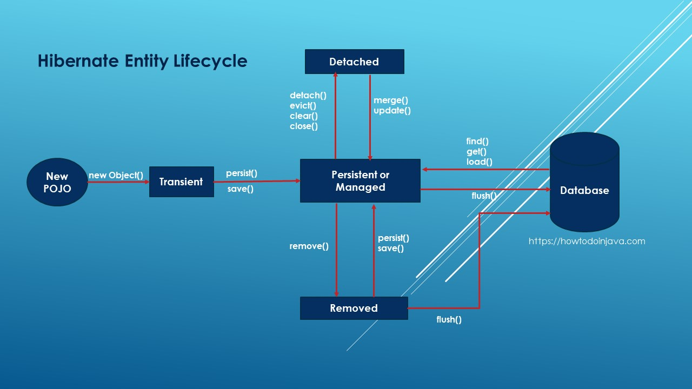

# 1) Коротко простыми словами: что такое N+1
`N+1` — это антипаттерн при работе с ORM: вместо одной (оптимальной) выборки данных ORM выполняет 1 запрос за коллекцию (или родительские сущности) + по одному запросу **на каждый** связанный элемент, в итоге `1 + N` запросов к БД. Это сильно бьёт по производительности (много сетевых раундтрипов, нагрузка на БД). Подробности и почему это важно — см. объяснение от Vlad Mihalcea.

# 2) Где он обычно возникает (сценарий)
Частая пара сущностей:

```
Post (id, title)  1 --- *  PostComment (id, post_id, review)
```

Код репозитория (Spring Data JPA):

```java
public interface PostRepository extends JpaRepository<Post, Long> {}
```

Сервис:

```java
List<Post> posts = postRepository.findAll();
for (Post p : posts) {
    System.out.println(p.getComments().size()); // lazy load -> может вызвать отдельный SELECT для каждой записи
}
```

Что произойдёт (лог SQL):  
1. `SELECT * FROM post;`  — 1 запрос  
2. Для каждого `post` при обращении к `getComments()` — `SELECT * FROM post_comment WHERE post_id = ?` — N запросов  
Итого: `1 + N`.

# 3) Как обнаружить/доказать проблему
Практические способы:
- Включить SQL-лог `spring.jpa.show-sql=true` и `spring.jpa.properties.hibernate.format_sql=true` — смотреть, сколько запросов выполняется.
- Использовать p6spy или datasource-proxy для красивых логов SQL.  
- Hibernate Statistics / Hypersistence Utils для автоматического детектирования N+1 в тестах.

Пример настройки в `application.properties`:
```properties
spring.jpa.show-sql=true
spring.jpa.properties.hibernate.format_sql=true
logging.level.org.hibernate.SQL=DEBUG
logging.level.org.hibernate.type.descriptor.sql.BasicBinder=TRACE
```

# 4) Типичные причины (коротко)
- Связи `LAZY` по умолчанию, и доступ к коллекциям/свойствам приводит к ленивой инициализации по одному элементу.
- Неверное ожидание, что ORM подтянет связи «само собой».
- Использование `JOIN FETCH` с коллекциями и пагинацией (побочные эффекты).

# 5) Категории решений — обзор (кратко)
1. `JOIN FETCH` (JPQL/HQL) — один SQL с JOIN.  
2. `@EntityGraph` (Spring Data JPA) — декларативный fetch graph.  
3. DTO-проекции (select new / Spring projection) — не грузим сущности.  
4. Batch fetching / `@BatchSize` и `hibernate.default_batch_fetch_size` — бьёт на блоки (2..k запросов вместо N).  
5. L2 cache (Hibernate second-level cache) — уменьшает обращение к БД.  
6. Подход «двух шагов» для пагинации: сначала получить ID-страницы, потом выбрать детей через IN.  
7. Инструменты: Hypersistence Utils (детектирование), p6spy (логирование).  
Каждый способ — свои плюсы/минусы; дальше — подробно с кодом и рекомендациями.

---

# 6) Подробно: воспроизведение примера (полный код сущностей + лог SQL)

## Сущности (упрощённо)
```java
@Entity
@Table(name = "post")
public class Post {
    @Id
    private Long id;

    private String title;

    @OneToMany(mappedBy = "post", fetch = FetchType.LAZY)
    private List<PostComment> comments = new ArrayList<>();

    // getters/setters
}

@Entity
@Table(name = "post_comment")
public class PostComment {
    @Id
    private Long id;

    @ManyToOne(fetch = FetchType.LAZY)
    @JoinColumn(name = "post_id")
    private Post post;

    private String review;
    // getters/setters
}
```

`PostRepository`:
```java
public interface PostRepository extends JpaRepository<Post, Long> {}
```

Сервис (плохо — вызывает N+1):
```java
List<Post> posts = postRepository.findAll(); // 1 SQL
for (Post p : posts) {
    // при первом обращении к comments — каждое вызывает отдельный SELECT -> N SQL
    int cnt = p.getComments().size();
}
```

Пример логов (в формате):
```
SELECT id, title FROM post;                        -- 1
SELECT id, post_id, review FROM post_comment WHERE post_id = 1;  -- for post 1
SELECT id, post_id, review FROM post_comment WHERE post_id = 2;  -- for post 2
...
```

---

# 7) Способ 1 — `JOIN FETCH` (JPQL / HQL)
**Идея**: явно попросить ORM подтянуть связанные сущности в одном SQL через `JOIN FETCH`.

Пример репозитория:
```java
public interface PostRepository extends JpaRepository<Post, Long> {

    @Query("SELECT DISTINCT p FROM Post p JOIN FETCH p.comments")
    List<Post> findAllWithComments();
}
```

Что происходит в SQL:
```sql
SELECT p.id, p.title, c.id, c.post_id, c.review
FROM post p
LEFT JOIN post_comment c ON c.post_id = p.id
```

Плюсы:
- Одним запросом подтянули всё — нет N+1.

Минусы и подводные камни:
- JOIN FETCH с коллекцией приводит к *дублированию* строк для `Post` (каждый `Post` повторяется для каждого `Comment`) → Hibernate сделает десериализацию с удалением дублей, но это увеличивает объём передаваемых данных.
- **Главный капкан**: **JOIN FETCH + pagination (Pageable)** — приводит к некорректной или неэффективной пагинации (Hibernate может сделать in-memory pagination или выдать предупреждение/ошибку). Документация Hibernate объясняет: при ограничении/пагинации с FETCH JOIN Hibernate обычно подтягивает все строки и делает ограничение в памяти — плохая производительность.

Когда использовать:
- Удобно и правильно при выборке малого количества данных и если не используете `Pageable`. Хорош для детальных view, где нужен родитель + дети сразу.

---

# 8) Способ 2 — `@EntityGraph` (Spring Data JPA)
**Идея**: декларативно указать, какие атрибуты нужно принудительно получить, при этом не меняя JPQL. `EntityGraph` работает лучше в сочетании с репозиториями и часто корректно с пагинацией (в отличие от `JOIN FETCH` коллекций).

Пример:
```java
@Entity
@NamedEntityGraph(name = "Post.comments",
    attributeNodes = @NamedAttributeNode("comments"))
public class Post { ... }
```

Репозиторий:
```java
public interface PostRepository extends JpaRepository<Post, Long> {

    @EntityGraph(value = "Post.comments", type = EntityGraph.EntityGraphType.LOAD)
    @Query("SELECT p FROM Post p")
    List<Post> findAllWithCommentsGraph();
}
```

Или проще с Spring Data:
```java
@EntityGraph(attributePaths = {"comments"})
List<Post> findAll();
```

Плюсы:
- Чище, декларативно.
- Часто совместим с `Pageable` (в отличие от JOIN FETCH на коллекциях).

Минусы:
- Не всегда очевидно как будет выполнен SQL под капотом — стоит смотреть лог.
- Может генерировать JOIN'ы тоже (но Spring Data часто использует `fetchgraph`/`loadgraph` поведение), поэтому тестируйте.

Когда использовать:
- Рекомендуется, когда нужно локально переопределить стратегию загрузки для конкретного метода репозитория, особенно в сервисном слое.

---

# 9) Способ 3 — DTO-проекции (рекомендуемый для чтения)
**Идея**: не загружать сущности целиком, а сразу выбрать ровно те поля, что нужны, в DTO — и убрать N+1 полностью (потому что вы сами формируете JOIN’ы/проекции).

Пример DTO + репозиторий:

DTO:
```java
public class PostDto {
    private Long postId;
    private String title;
    private Long commentId;
    private String commentReview;
    // constructor, getters
}
```

Репозиторий (JPQL):
```java
@Query("SELECT new com.example.dto.PostDto(p.id, p.title, c.id, c.review) " +
       "FROM Post p LEFT JOIN p.comments c")
List<PostDto> findAllPostsWithCommentsDto();
```

Или с Spring Data (interface projection) — легче и эффективнее.

Плюсы:
- Нет управления состоянием сущностей — меньше памяти, быстрее сериализация на REST.
- Нет проблемы с `lazy` — вы явно делаете JOIN, и вы контролируете поля.

Минусы:
- Может требоваться ручная агрегация в Java (если вы хотите 1 DTO с коллекцией комментариев, а не «плоские» строки).
- При плоской проекции возвращается `Nrows` и родитель повторяется — нужно сгруппировать в коде (Collectors.groupingBy) или вернуть paged result с агрегацией.

Когда использовать:
- Для read-only API/слоёв представления, где вам нужны только данные, а не управляемые JPA-сущности — **часто лучший выбор для продакшна**.

---

# 10) Способ 4 — Batch fetching (`@BatchSize`, `hibernate.default_batch_fetch_size`)
**Идея**: при ленивой инициализации Hibernate может загрузить связанные сущности пакетами (IN (...)) — вместо N отдельных запросов он выполнит ~N/batchSize запросов.

Аннотация:
```java
@OneToMany(mappedBy = "post")
@BatchSize(size = 10)
private List<PostComment> comments;
```

Либо глобально в `application.properties`:
```properties
spring.jpa.properties.hibernate.default_batch_fetch_size=16
```

Что делает Hibernate:
- При обращении к коллекциям нескольких постов он соберёт список `post_id` и выполнит `SELECT ... FROM post_comment WHERE post_id IN (?, ?, ?, ...)` с размером IN = batchSize, т.е. несколько запросов вместо N.

Плюсы:
- Простой способ уменьшить число запросов без изменения запросов в коде.
- Хорош при больших выборках, когда JOIN'ы приводят к большим объёмам данных.

Минусы:
- Всё ещё выполняется несколько запросов (не один).
- Если `batchSize` выбран неудачно — возможны неэффективные IN-запросы.
- Сложность настроить оптимально для различных мест.

Когда использовать:
- Как компромиссный вариант, особенно когда JOIN FETCH нежелателен из-за объёма данных.

---

# 11) Способ 5 — «двухшаговая» стратегия для пагинации (safe pagination)
Проблема: `JOIN FETCH` коллекций с `Pageable` → неверная/неэффективная пагинация. Решение: сделать два запроса:
1. Запросить страницу `Post` (только `id` и колонки поста) с `LIMIT/OFFSET`.
2. Второй запрос: загрузить все `comments` для этих `post.id` одним IN-запросом (`SELECT ... WHERE post_id IN (...)`) и связать в памяти.

Пример:
```java
// 1) получить посты с пагинацией (только Posts)
Page<Post> page = postRepository.findAll(pageable);

// 2) получить все комментарии за один запрос
List<Long> postIds = page.getContent().stream().map(Post::getId).collect(Collectors.toList());
List<PostComment> comments = commentRepository.findByPostIdIn(postIds);

// 3) сгруппировать и присвоить
Map<Long, List<PostComment>> byPost = comments.stream()
    .collect(Collectors.groupingBy(c -> c.getPost().getId()));
for (Post p : page.getContent()) {
    p.setComments(byPost.getOrDefault(p.getId(), Collections.emptyList()));
}
```

Плюсы:
- Пагинация остаётся корректной и эффективной.
- Один дополнительный IN-запрос вместо N.

Минусы:
- Немного больше кода на сервисе.
- При большом числе `postIds` IN-запрос может стать большой, но обычно ограничен размером страницы (например 20—100).

Когда использовать:
- При пагинации списка с коллекциями — это практический и безопасный паттерн.

Дополнительные улучшения:
- Blaze-Persistence / Hibernate 6 улучшения (window functions) решают некоторые задачи, но в большинстве проектов двухшаговая стратегия — практичный вариант.

---

# 12) Способ 6 — Second-level cache (L2)
**Идея**: кешировать сущности/коллекции в L2-кэше (например, Ehcache, Infinispan) — тогда повторные обращения не будут попадать в БД.

Плюсы:
- Может сократить запросы (если данные «горячие» и редко меняются).

Минусы:
- Сложность инвалидации, увеличение сложности архитектуры.
- Не решает полностью проблему при первом обращении — только при повторных.

Когда использовать:
- Если у вас много повторяющихся чтений одних и тех же сущностей и вы готовы управлять кэшем и консистентностью.

---

# 13) Инструменты для отладки и тестирования
- p6spy / datasource-proxy — логирование SQL.  
- Hypersistence Utils — detection of N+1 during tests.  
- Hibernate Statistics (`sessionFactory.getStatistics()`) — метрики запросов и загрузок.

Пример проверки в тесте:
```java
SessionFactory sf = entityManagerFactory.unwrap(SessionFactory.class);
Statistics stats = sf.getStatistics();
stats.setStatisticsEnabled(true);

// выполнить сценарий
int queriesBefore = stats.getQueryExecutionCount();
// ... вызов метода ...
int queriesAfter = stats.getQueryExecutionCount();
```

---

# 14) Сводная таблица методов (кратко)

# Таблица: методы борьбы с N+1 — сравнение

| Метод | Количество SQL | Поддержка пагинации | Сложность | Когда лучше |
|---|---:|:---:|:---:|---|
| JOIN FETCH | 1 (но с JOIN) | Плохая с коллекциями (in-memory) | Низкая | Небольшие выборки, без пагинации |
| @EntityGraph | 1 (обычно JOIN) | Лучше чем JOIN FETCH для Page | Средняя | Когда используете Spring Data, хотим декларативно |
| DTO-проекция | 1 (контролируемый SELECT) | Хорошо | Средняя | Read-only API, лучшая производительность |
| @BatchSize / batch fetch | ≈ N / batchSize запросов | Хорошо | Низкая | Компромисс, большие наборы, избегаем JOIN'ов |
| 2-step (IDs then IN) | 2 запросa (page + IN) | Отлично | Низкая/средняя | Пагинация с коллекциями — практичный подход |
| L2 Cache | Зависит (может убрать DB) | Зависит | Высокая | Когда данные редко меняются |

(Основано на практических руководствах и статьях по теме).

---

# 15) Практические рекомендации — что выбирать в реальном мире
1. **Профилирование прежде чем лечить** — не улучшать «наугад», а замерить метрики (SQL, latency). Используйте p6spy + Hibernate stats.  
2. Для **read-only** эндпоинтов — используйте **DTO-проекции** (конструктор JPQL / Spring projections). Быстрее и безопаснее.  
3. Для **CRUD, где нужны сущности** — `@EntityGraph` для конкретных методов; это безопаснее, чем глобальное `EAGER`.  
4. Для **страничных списков с коллекциями** — используйте двухшаговый подход: сначала посты (page), потом IN-по-ids. Это обычно самый практичный и масштабируемый вариант.  
5. `@BatchSize` — хороший компромисс если вы не готовы рефакторить все запросы. Но учтите, что это просто уменьшит число запросов, а не избавит полностью.  
6. **Не делайте `FetchType.EAGER` по умолчанию** — это код-запах (см. best practices). Всегда предпочитайте `LAZY` и локально контролируйте загрузку.

---

# 16) Полные примерные сценарии с кодом и SQL (несколько подходов)

### A) Плохой подход — вызывает N+1
```java
List<Post> posts = postRepository.findAll();
for (Post p : posts) {
    // lazy -> отдельный select на каждый post
    p.getComments().forEach(System.out::println);
}
```
SQL: `1 + N` запросов (см. выше)

---

### B) JOIN FETCH — один запрос (не для пагинации)
```java
@Query("SELECT DISTINCT p FROM Post p LEFT JOIN FETCH p.comments")
List<Post> fetchAllWithComments();
```
SQL:
```sql
SELECT p.*, c.* 
FROM post p
LEFT JOIN post_comment c ON c.post_id = p.id;
```

---

### C) EntityGraph (Spring Data)
```java
@EntityGraph(attributePaths = {"comments"})
@Query("SELECT p FROM Post p")
Page<Post> findAllWithCommentsGraph(Pageable pageable);
```
Проверять SQL — Spring Data может сгенерировать join или отдельные selects — проверьте лог.

---

### D) DTO-проекция + агрегация (без дубликатов)
Если JPQL `new` возвращает плоские строки, то в сервисе сгруппируем:

```java
@Query("SELECT new com.example.dto.FlatPostDto(p.id, p.title, c.id, c.review) " +
       "FROM Post p LEFT JOIN p.comments c")
List<FlatPostDto> flat = repo.findFlat();
Map<Long, PostView> grouped = flat.stream()
    .collect(Collectors.groupingBy(FlatPostDto::getPostId,
         Collectors.mapping(f -> new CommentDto(f.getCommentId(), f.getReview()), Collectors.toList())));
```

---

### E) Two-step pagination safe
(см. секцию 11) — код выше.

---

# 17) Частые ошибки и подводные камни (буллеты)
- Давать `EAGER` в мэппинге «всем и сразу». Это делает все запросы большими и неуправляемыми.  
- Юзать `JOIN FETCH` с `Pageable` без понимания — получите ин- мемори пагинацию.  
- Полагаться только на `@BatchSize` как на панацею — он уменьшит запросы, но не избавит от дополнительной нагрузки.  
- Игнорировать SQL-лог: без логов вы не заметите N+1.

---

# 18) Полезные команды / настройки для Spring Boot проекта

`application.yml` — базовое для логов:
```yaml
spring:
  jpa:
    show-sql: true
    properties:
      hibernate:
        format_sql: true
logging:
  level:
    org.hibernate.SQL: DEBUG
    org.hibernate.type.descriptor.sql.BasicBinder: TRACE
```

Hibernate batch:
```properties
spring.jpa.properties.hibernate.default_batch_fetch_size=16
```

p6spy подключение — отдельная зависимость, полезно для красивых логов SQL.

---

# 19) Ещё «много чего» — дополнительные тонкости и советы
- **Кардинальное решение**: при высоких нагрузках поменяйте стратегию чтения: CQRS — read модели строятся специально для запросов (DTO, materialized views), тогда ORM-сложности не влияют.  
- **Blaze-Persistence** — библиотека, которая решает некоторые проблемы с join fetch + pagination и даёт мощные API. Vlad Mihalcea упоминает лучшие паттерны для пагинации.  
- **Тесты на N+1**: добавьте unit/integration тесты, которые фиксируют число SQL-запросов для критичных сценариев (Hypersistence Utils помогает).  
- **Индексы**: N+1 делает множество SELECT по `WHERE fk = ?` — убедитесь, что есть индекс по `post_id` в таблице комментариев. Это не решит N+1, но уменьшит стоимость каждого запроса.

---

# 20) Итог — что запомнить (коротко)
- N+1 — это про **лишние запросы**; сначала **измерьте**, потом решайте.  
- Для **read** — DTO-проекции чаще всего лучший вариант.  
- Для **CRUD/сущностей** — `@EntityGraph` и/или двухшаговая пагинация; `JOIN FETCH` — полезен, но осторожно с пагинацией.  
- `@BatchSize` — быстрый компромисс, но не панацея.

---

# 21) Ссылки на источники (для чтения и подтверждения)
1. Vlad Mihalcea — «N+1 query problem with JPA and Hibernate» (объяснение и практики).  
2. Baeldung — статья «N+1 problem in Hibernate and Spring Data JPA» (примеры и варианты решения).  
3. Hibernate Query Language / документация — предупреждение про `FETCH JOIN` + pagination.  
4. Spring Data JPA `@EntityGraph` (официальная документация).  
5. Hibernate `@BatchSize` javadoc (описание поведения batch fetching).

---


# Оптимизация запросов в Spring Boot (Spring Data JPA) + PostgreSQL — очень подробный ответ для собеседования (на русском)

Ниже — развёрнутый, практический разбор: что происходит, почему возникают проблемы, как их диагностировать и лечить, какие способы лучше/хуже в разных ситуациях, много примеров кода (JPA / Spring Data / JdbcTemplate), SQL-запросов, конфигураций и текстовых диаграмм. Ссылки на авторитетные источники приведены у ключевых утверждений.

---

## 1) Кратко и просто: что такое «оптимизация запросов» в этом стеке
Оптимизация запросов — это набор практик, приёмов и конфигураций, которые уменьшают время ответа и нагрузку на БД/сеть/память при работе Spring Boot приложения с PostgreSQL через Spring Data / JPA / Hibernate. Это включает:
- уменьшение числа SQL-запросов (избавление от N+1),
- уменьшение объёма передаваемых данных (проекции/DTO),
- правильная пагинация/стриминг больших наборов,
- батчевые операции (insert/update),
- правильные индексы и структура схемы,
- настройка пули соединений и JDBC/driver/ORM параметров,
- анализ и правка «узких мест» через EXPLAIN / pg_stat_statements.

(Полезный инструмент для поиска «тяжёлых» запросов — расширение `pg_stat_statements` в Postgres.)

---

## 2) Почему возникают проблемы (корень проблем)
Основные причины медленных/неэффективных запросов:

1. **N+1 problem** — при загрузке коллекции/ассоциаций ORM делает 1 долгий запрос + N дополнительных запросов на связанные сущности. Это классическая проблема JPA/Hibernate.  
2. **Отсутствие/неподходящие индексы** — бд вынуждена делать sequential scan по большой таблице.  
3. **Пагинация через OFFSET для больших таблиц** — OFFSET заставляет СУБД пропустить N строк (дорого). Лучше keyset/seek-пагинация.  
4. **Неправильная стратегия загрузки / lazy vs eager** — eager может подтянуть лишние данные, lazy — породить N+1 при доступе.  
5. **Большие объёмы данных в одном ResultSet** — если JDBC буферирует всё, приложение может упереться в память; нужно использовать fetchSize/streaming. (В Postgres fetchSize работает при autocommit=false.)  
6. **Много маленьких INSERT/UPDATE без батчей** — множество round-trip'ов по сети. Hibernate умеет батчить, но нужно правильно настроить.

---

## 3) Как диагностировать: инструменты и порядок действий (шаги)
1. Включить логирование SQL в приложении (и с таймингами) — `spring.jpa.show-sql` + `logging.level.org.hibernate.SQL=DEBUG`, `org.hibernate.type=TRACE` (только для диагностики).  
2. Собрать slow queries на стороне БД: `pg_stat_statements` + `pg_stat_activity` + Postgres лог slow_query.  
3. Для подозрительных запросов запускать `EXPLAIN (ANALYZE, BUFFERS)` в psql — смотреть, index scan vs seq scan, сортировки, хеш-join, оценка vs фактическое время.  
4. Снимаем метрики: latency, TPS, connection pool usage (Hikari), CPU/IO на БД.  
5. Идентифицируем N+1: смотреть количество SQL-запросов при выполнении операции (например, через интеграционные тесты или p6spy).  
6. Если нужно — профайлер (async-profiler, flight recorder) для JVM.  

**Мини-чеклист сначала чем лечить**: лог SQL → pg_stat_statements → EXPLAIN → изменение индекса/запроса → настройка fetch/batch → мониторинг.

---

## 4) Конкретные причины и как лечить (способы, с примерами)

### 4.1. N+1 — обнаружение и исправление

**Проблема (схема)**:
```
SELECT * FROM orders;          -- 1 запрос (N rows)
for each order:
    select * from order_items where order_id = :id;  -- N запросов
```

**Как лечить (варианты)**:
1. **Fetch join** — в JPQL/HQL: `select o from Order o join fetch o.items where ...`  
   Пример Spring Data @Query:
```java
// Репозиторий
public interface OrderRepository extends JpaRepository<Order, Long> {
    @Query("select o from Order o join fetch o.items where o.id = :id")
    Optional<Order> findByIdWithItems(@Param("id") Long id);
}
```
Комментарий: `join fetch` сразу подтянет коллекцию в одном SQL. Но будьте осторожны с множественными коллекциями — может возникнуть Cartesian product (дублирование строк).

2. **EntityGraph** — декларативный способ, удобен для репозиториев:
```java
@Entity
@NamedEntityGraph(name = "Order.items", attributeNodes = @NamedAttributeNode("items"))
public class Order { ... }

public interface OrderRepository extends JpaRepository<Order, Long> {
    @EntityGraph(value = "Order.items", type = EntityGraph.EntityGraphType.LOAD)
    Optional<Order> findWithItemsById(Long id);
}
```
Комментарий: `EntityGraph` даёт гибкий контроль, не трогая JPQL. Особенно полезно в сложных моделях.

3. **DTO / Проекции** — если нужно только часть данных, лучше проецировать в DTO через конструктор в JPQL или интерфейсную проекцию → не тянуть связи вообще.  
```java
public class OrderSummary {
  public OrderSummary(Long id, String customerName, int itemsCount) { ... }
}

@Query("select new com.example.OrderSummary(o.id, o.customer.name, size(o.items)) from Order o where o.id = :id")
OrderSummary findSummaryById(@Param("id") Long id);
```
Преимущество: меньший объём данных и отсутствие пуш-асссоциаций.

**Когда что использовать?**  
- Для загрузки связей для бизнес-логики: `fetch join` / `EntityGraph`.  
- Для вывода в UI/API: DTO-проекции (лучше) — они контролируют колонку, избегают N+1, уменьшают память.

(Классика: N+1 — громадная тема в JPA/Hibernate; см. руководство Hibernate и практические статьи.)

---

### 4.2. Батчи (batch inserts/updates) — как настроить и нюансы

**Проблема:** множество отдельных INSERT → много сетевых round-trip'ов.

**Решение (Hibernate):**
- В `application.properties` / `application.yml`:
```properties
spring.jpa.properties.hibernate.jdbc.batch_size=50
spring.jpa.properties.hibernate.order_inserts=true
spring.jpa.properties.hibernate.order_updates=true
# отключаем генерацию id типа IDENTITY, лучше использовать sequence + pooled оптимизатор
spring.jpa.properties.hibernate.id.new_generator_mappings=true
```

**Код для вставки большого объёма — с контролем Session:**
```java
// service
@Transactional
public void batchInsert(List<MyEntity> items) {
    int batchSize = 50;
    for (int i = 0; i < items.size(); i++) {
        em.persist(items.get(i));
        if (i % batchSize == 0) {
            em.flush();
            em.clear(); // важно — чтобы не накапливать объекты в persistence context
        }
    }
    // остаток
    em.flush();
    em.clear();
}
```
Комментарий: `flush()` отправляет батч, `clear()` освобождает память persistence context. Batch работает корректно, когда не используется `IDENTITY` генерация PK (Hibernate не может батчить при identity); лучше использовать sequence + pooled optimizer.

**Пара советов**:
- `hibernate.jdbc.batch_size` 10–100 — зависит от приложения/DB.
- Включите `order_inserts=true` чтобы Hibernate группировал вставки по таблицам (увеличивает шанс батчинга).
- Тестируйте: иногда `order_inserts`/`order_updates` может повредить (управляйте по нагрузке).

---

### 4.3. Fetch size и streaming (когда много строк)

**Проблема:** запрос возвращает миллионы строк — приложение OOM или БД/Сеть перегружены.

**Решение 1 — JDBC / JdbcTemplate streaming**  
- Установить `fetchSize` и выключить autocommit (Postgres driver использует серверный курсор только при autocommit=false).
```java
// пример с JdbcTemplate
jdbcTemplate.query(
  con -> {
    PreparedStatement ps = con.prepareStatement("SELECT id, data FROM big_table WHERE ...");
    con.setAutoCommit(false);              // важно для postgresql cursor behavior
    ps.setFetchSize(50);                   // не загружать всё сразу
    return ps;
  },
  (ResultSet rs) -> {
    while (rs.next()) {
      // обрабатываем строку
    }
  }
);
```
Комментарий: `setFetchSize` заставляет Postgres возвращать данные порциями; без `setAutoCommit(false)` драйвер может сбросить курсор и прочитать всё в память.

**Решение 2 — Spring Data Stream / Streamable**  
```java
@Query("select e from BigEntity e")
Stream<BigEntity> streamAll();
```
И использовать внутри `@Transactional` и аккуратно закрывать stream, чтобы не утаивать connection.

**Когда использовать**: для экспортов/ETL/обработки больших таблиц. Для API отдавайте пагинированные куски, а не весь набор.

---

### 4.4. Пагинация: OFFSET vs Keyset (seek) — предпочтения

**OFFSET (стандартный `Pageable`)**: `LIMIT 50 OFFSET 1000000` — для больших offset'ов дорого, Postgres вынужден пересчитать/проскроллить строки.  
**Keyset (seek) pagination** — лучше для больших табличек: используем WHERE (колонка < lastSeen) ORDER BY колонка DESC LIMIT n.

**Пример keyset в Spring Data (native query)**
```java
@Query(value = "select * from items where (created_at, id) < (:createdAt, :id) order by created_at desc, id desc limit :limit", nativeQuery = true)
List<Item> findPageAfter(@Param("createdAt") Instant createdAt, @Param("id") Long id, @Param("limit") int limit);
```
Комментарий: в multi-column ordering используем tuple `(created_at, id)` для корректного порядка при равных created_at.

**Плюсы keyset**: стабильно быстро для больших наборов, не теряет производительности с ростом страницы. Минусы: нельзя произвольно брать 10-ю страницу (нужно цепочкой «следующая»), сложнее реализовать «страницы назад».

---

### 4.5. Индексы и схема — какие индексы и почему

**Правила:**
- Индексируйте колонки, которые участвуют в WHERE, JOIN, ORDER BY.  
- Для `LIKE '%xxx'` обычный b-tree не помогает — используйте `pg_trgm` + GIN или GIST.  
- Для JSONB используйте **GIN** индексы (`->>`, `@>` операторы). Но GIN может иметь накладные расходы при частых обновлениях.

**Примеры:**
```sql
-- B-tree для фильтрации по email
CREATE INDEX idx_users_email ON users(email);

-- GIN для jsonb
CREATE INDEX idx_orders_payload_gin ON orders USING gin (payload jsonb_path_ops);

-- trigram (для ILIKE %foo%)
CREATE EXTENSION IF NOT EXISTS pg_trgm;
CREATE INDEX idx_products_name_trgm ON products USING gin (name gin_trgm_ops);
```

**Тонкости**: индекс — не панацея. EXPLAIN покажет, использует ли план индекс; иногда optimizer выбирает seq scan (например, если селективность низкая или статистика устарела — `ANALYZE`).

---

### 4.6. Prepared statements / план кэширование / pg_stat_statements

- JDBC и Hikari поддерживают prepared statements; драйвер Postgres кеширует планы и готовые состояния. Prepared statements снижают парсинг/планирование.  
- `pg_stat_statements` — используем для поиска самых «тяжёлых» запросов по времени/частоте. Это даёт быстрый обзор куда смотреть.

---

### 4.7. Кеширование (2nd level cache) — когда и как
- Вторичный кэш Hibernate (Ehcache, Hazelcast) может снизить нагрузку на БД для часто читаемых сущностей. Но: сложнее invalidation при частых изменениях, может привести к стале-данным. Использовать для редко меняющихся справочных сущностей. (Hibernate user guide подробно описывает кеши.)

---

### 4.8. Bulk update/delete (Modifying queries)
Используйте `@Modifying` + `@Query` для массовых операций — это выполняет один SQL (большой UPDATE) и не загружает сущности в память.
```java
@Modifying
@Query("update Order o set o.status = :status where o.createdAt < :olderThan")
int updateOldOrders(@Param("status") String status, @Param("olderThan") Instant olderThan);
```
Комментарий: после bulk-операций EntityManager может содержать устаревшие сущности — стоит `em.clear()`.

---

## 5) Примеры конфигураций — application.properties / YAML

**Hibernate + Hikari (типичная настройка):**
```properties
spring.datasource.url=jdbc:postgresql://db:5432/app
spring.datasource.username=app
spring.datasource.password=secret
spring.datasource.hikari.maximum-pool-size=20
spring.datasource.hikari.minimum-idle=5
spring.datasource.hikari.connection-timeout=30000
spring.datasource.hikari.max-lifetime=1800000

# JPA / Hibernate
spring.jpa.properties.hibernate.jdbc.fetch_size=50
spring.jpa.properties.hibernate.jdbc.batch_size=50
spring.jpa.properties.hibernate.order_inserts=true
spring.jpa.properties.hibernate.order_updates=true
spring.jpa.properties.hibernate.generate_statistics=false  # включать только для профайла
spring.jpa.properties.hibernate.default_batch_fetch_size=16
spring.jpa.properties.hibernate.temp.use_jdbc_metadata_defaults=false
```
Комментарий: `hibernate.jdbc.fetch_size` и `setFetchSize` взаимодействуют; для больших выборок используйте JDBC streaming (см. выше).

---

## 6) EXPLAIN (ANALYZE) — пример и как читать (текстовая диаграмма)
Пример запроса:
```sql
EXPLAIN (ANALYZE, BUFFERS, FORMAT TEXT)
SELECT u.id, u.email FROM users u
JOIN orders o ON o.user_id = u.id
WHERE o.created_at > now() - interval '30 days'
ORDER BY o.created_at DESC
LIMIT 100;
```

Пример упрощённого вывода и разбор (символично):
```
Limit  (cost=... rows=100) (actual time=120.0..120.5 rows=100 loops=1)
  ->  Sort  (cost=... ) (actual time=120.0..120.3 rows=100 loops=1)
        Sort Key: o.created_at DESC
    ->  Hash Join  (cost=... ) (actual time=20.0..90.0 rows=5000 loops=1)
          Hash Cond: (o.user_id = u.id)
          -> Seq Scan on orders o  (cost=... ) (actual time=0.1..30.0 rows=200000 loops=1)
                Filter: (created_at > ...)
          -> Hash  (cost=...) (actual time=5.0..5.0 rows=20000 loops=1)
                -> Seq Scan on users u
```
Как читать:
- `actual time` — реальные времена (важнее `cost`).  
- Если `Seq Scan on orders` над большой таблицей → посмотрите индексы на `created_at` (или комбинированный индекс `created_at, user_id`).  
- `Sort` — если сортировка занимает много, можно использовать индекс с подходящим ORDER BY, или изменить запрос/индекс.  

**Вывод**: EXPLAIN показывает где тратится время — на сканы, сортировки или соединения.

---

## 7) Таблица: методы оптимизации — когда применять, плюсы/минусы

# Методы | Когда применять | Плюсы | Минусы
---|---:|---|---
Fetch join / EntityGraph | Нужно загрузить связанные сущности за 1 запрос | Уменьшает N+1, быстро | Дублирование строк (для нескольких коллекций), осторожно с pageable
DTO / проекции | API / меньше полей | Меньше передачи данных, проще | Нужно проецировать вручную
Batch insert/update (hibernate.jdbc.batch_size) | Массовые вставки/обновления | Снижает сетевые round-trip | Не работает с IDENTITY, нужен flush/clear
Keyset pagination | Большие таблицы, "next" страницы | Быстро и стабильно | Нет случайного доступа к произвольной странице
FetchSize / streaming | Экспорт/ETL больших наборов | Низкая память, потоковая обработка | Нужно autocommit=false, следить за connection lifetime
Indexes (B-tree, GIN, trigram) | Частые фильтры/поиск по json/LIKE | Может радикально улучшить план | Индексы увеличивают cost при записьах/обновлениях
Second-level cache | Чтение редко меняющихся сущностей | Снижение запросов | Сложность invalidation, синхронизация

(таблица — краткая шпаргалка для собеседования)

---

## 8) Частые «ошибки/подводные камни», на которые обращают внимание интервьюеры
- Ожидание что `@OneToMany(fetch = EAGER)` — это хорошо. Наоборот: по умолчанию LAZY лучше.  
- Попытка батчить с `GenerationType.IDENTITY` — не сработает (Hibernate не может заранее знать id). Лучше `SEQUENCE` с оптимизатором.  
- Использование `OFFSET` для deep-pagination — плохо на больших таблицах.  
- Включение SQL-логов в production без ротации/ограничения — огромный объем логов.  
- Забыли `em.clear()` при массовых операциях → OutOfMemory.  
- Полагаетесь на ORM для всего — иногда нативный/сервисный SQL (CTE, window functions) будет быстрее.

---

## 9) Практические шаблоны кода — «copy-paste» для собеседования

### 9.1. EntityGraph + Repository
```java
@Entity
@NamedEntityGraph(name = "User.orders",
    attributeNodes = @NamedAttributeNode("orders"))
public class User { ... }

public interface UserRepository extends JpaRepository<User, Long> {
    @EntityGraph(value = "User.orders", type = EntityGraph.EntityGraphType.LOAD)
    List<User> findByActiveTrue();
}
```

### 9.2. Batch insert service (Hibernate / JPA)
```java
@Service
public class MyEntityBatchService {
    @PersistenceContext
    private EntityManager em;

    @Transactional
    public void saveBatch(List<MyEntity> items) {
        final int batchSize = 50;
        for (int i = 0; i < items.size(); i++) {
            em.persist(items.get(i));
            if (i % batchSize == 0) {
                em.flush();
                em.clear();
            }
        }
        em.flush();
        em.clear();
    }
}
```

### 9.3. JdbcTemplate streaming (fetchSize)
```java
public void streamLargeTable() {
    jdbcTemplate.query(
      (Connection con) -> {
        con.setAutoCommit(false); // обязательно для PG
        PreparedStatement ps = con.prepareStatement("SELECT id, payload FROM big_table");
        ps.setFetchSize(100);
        return ps;
      },
      (ResultSet rs) -> {
        while (rs.next()) {
          // обработка
        }
      }
    );
}
```

### 9.4. Keyset pagination (native)
```java
@Query(value = "select id, name, created_at from items where (created_at, id) < (:createdAt, :id) order by created_at desc, id desc limit :limit", nativeQuery = true)
List<Item> findAfter(@Param("createdAt") Instant createdAt, @Param("id") Long id, @Param("limit") int limit);
```

---

## 10) Что мерить и какие метрики иметь в мониторинге (KPI)
- 95% и 99% latency для запросов к БД  
- Количество запросов / транзакций в секунду (QPS/TPS)  
- HikariCP active / idle connections  
- CPU, I/O, disk latency на Postgres  
- pg_stat_statements: total_time, calls, mean_time — топ-20 запросов по времени/частоте.

---

## 11) Советы «для настоящего интервью» — что не забыть озвучить
- Опишите **алгоритм**: логирование → pg_stat_statements → EXPLAIN → индекс/запрос/ORM-change → re-test. (покажите, что умеете диагностировать)  
- Назовите **N+1** и кратко опишите решения: fetch join, entity graph, DTO-проекции.  
- Упомяните **батчи** и что `IDENTITY` мешает батчам; расскажите про `flush()`/`clear()`.  
- Поговорите про **fetchSize/streaming** и необходимость `autocommit=false` для Postgres.  
- Объясните, почему **keyset pagination** лучше при больших таблицах.  
- Назовите инструменты: `EXPLAIN ANALYZE`, `pg_stat_statements`, p6spy, jfr/async-profiler`.

---

## 12) Резюме — «быстрая шпаргалка»
1. Сначала **измерьте** (pg_stat_statements + EXPLAIN), не оптимизируйте вслепую.  
2. Устраняйте N+1 (fetch join / EntityGraph / DTO).  
3. Индексы — нужные, но тестируйте (ANALYZE, EXPLAIN).  
4. Для больших выборок — **streaming** (fetchSize + autocommit=false) или keyset pagination.  
5. Батчьте вставки/обновления (`hibernate.jdbc.batch_size`, flush/clear), избегайте IDENTITY для массовых вставок.

---


# Ответы на вопросы по Hibernate (подготовка к собеседованию)

Ниже — подробные ответы по каждому из 20 вопросов. Там, где полезно, приведены примеры кода на Java и конфигурационные примеры.

---

## 1. Что такое Hibernate и зачем он используется в Java-приложениях?
**Ответ:**  
Hibernate — это ORM-фреймворк (Object-Relational Mapping) для Java. Он позволяет сопоставлять Java-классы с таблицами базы данных и автоматизирует CRUD-операции, SQL-генерацию и управление транзакциями. Основные преимущества:
- уменьшение объёма SQL-кода в приложении;
- переносимость между разными СУБД;
- управление кэшированием и оптимизация запросов;
- поддержка ленивой загрузки, каскадов и сложных связей между сущностями.

**Когда использовать:** при разработке приложений со сложной предметной моделью, где нужно сократить шаблонный JDBC-код и работать с объектной моделью бизнес-логики.

---

## 2. Разница между `get()` и `load()` методами в Hibernate
**Ответ:**  
Оба метода получают объект по первичному ключу, но поведение разное:

- `get(Class<T> clazz, Serializable id)`  
  - Выполняет немедленный запрос к базе данных и возвращает объект или `null`, если запись не найдена.  
  - Возвращает полностью инициализированный объект (если найден).

- `load(Class<T> clazz, Serializable id)`  
  - Возвращает прокси-объект без немедленного запроса. Запрос к БД выполнится только при обращении к полю (ленивая инициализация).  
  - Если объекта нет в базе — при доступе к прокси будет выброшено `ObjectNotFoundException`.  
  - Подходит, если вы уверенны в существовании записи и хотите отложить загрузку.

**Пример:**
```java
Session session = sessionFactory.openSession();
// get: сразу в БД
MyEntity e1 = session.get(MyEntity.class, 1L);
if (e1 == null) {
    System.out.println("Не найден");
}

// load: возвращает прокси, БД не опрашивается сразу
MyEntity e2 = session.load(MyEntity.class, 2L);
// здесь запрос выполнится при обращении к e2.getName()
System.out.println(e2.getName());
```

---

## 3. Как работает first-level cache (кеш первого уровня) в Hibernate?
**Ответ:**  
First-level cache — это кеш, связанный с объектом `Session`. Он:
- Включён по умолчанию.
- Живёт в рамках одной сессии (`Session`), автоматически сохраняется и очищается при закрытии сессии.
- Хранит все загруженные, сохранённые и сохранённые-перемешанные сущности; при повторном запросе по тому же идентификатору в пределах сессии Hibernate отдаёт объект из кеша, не обращаясь к БД.
- Помогает избежать повторных SQL-запросов и решает проблему идентичности объектов (в пределах сессии один и тот же идентификатор — один объект в памяти).

**Замечание:** кеш первого уровня — транзакционный и не разделяется между сессиями (в отличие от second-level cache).

---

## 4. Какова цель файла `hibernate.cfg.xml`?
**Ответ:**  
`hibernate.cfg.xml` — это основной файл конфигурации Hibernate (при использовании XML-конфигурации). В нём указывают:
- параметры подключения к базе данных (`url`, `username`, `password`, `driver`);
- настройки диалекта (`hibernate.dialect`);
- стратегии DDL (`hibernate.hbm2ddl.auto`);
- настройки кэша, пула соединений и логирования;
- маппинги сущностей (классы или mapping-файлы).

Пример фрагмента:
```xml
<?xml version='1.0' encoding='utf-8'?>
<!DOCTYPE hibernate-configuration PUBLIC
        "-//Hibernate/Hibernate Configuration DTD 3.0//EN"
        "http://hibernate.org/dtd/hibernate-configuration-3.0.dtd">
<hibernate-configuration>
  <session-factory>
    <property name="hibernate.connection.driver_class">org.postgresql.Driver</property>
    <property name="hibernate.connection.url">jdbc:postgresql://localhost:5432/mydb</property>
    <property name="hibernate.connection.username">user</property>
    <property name="hibernate.connection.password">pass</property>
    <property name="hibernate.dialect">org.hibernate.dialect.PostgreSQLDialect</property>
    <property name="hibernate.hbm2ddl.auto">validate</property>
    <!-- mappings -->
    <mapping class="com.example.model.MyEntity"/>
  </session-factory>
</hibernate-configuration>
```

---

## 5. Поясните концепцию lazy loading (ленивая загрузка) в Hibernate
**Ответ:**  
Ленивая загрузка — это отложенная инициализация связанных сущностей или коллекций до момента, когда они действительно понадобятся. Она помогает уменьшить количество данных, загружаемых из БД, и ускоряет начальные операции.

- По умолчанию многие ассоциации (`@OneToMany`, `@ManyToMany`) загружаются лениво; `@ManyToOne` и `@OneToOne` — обычно жёстко (eager), но это настраивается.
- Hibernate возвращает прокси-объекты и выполняет SQL только при доступе к полю/элементам коллекции.
- Важно: ленивые ассоциации требуют открытой сессии при обращении к прокси; иначе при попытке доступа вы получите `LazyInitializationException`. Решения: открыть сессию до использования, использовать `fetch join` в запросе, или применять паттерны `Open Session in View` / DTO проектирование.

**Пример аннотации:**
```java
@Entity
public class Order {
    @OneToMany(mappedBy="order", fetch = FetchType.LAZY)
    private Set<OrderItem> items;
}
```

---

## 6. Какие состояния сущности в Hibernate?
**Ответ:**  


Сущности в Hibernate проходят через три основных состояния:

1. **Transient (временное)** — объект создан в памяти через `new`, не связан с сессией, не имеет идентификатора (или идентификатор не сохранён в БД). Пример: `MyEntity e = new MyEntity();`.

2. **Persistent (управляемое/связанное)** — объект ассоциирован с открытой `Session` и будет синхронизирован с БД при flush/commit. Переход в состояние persistent — через `session.save()`, `persist()`, `get()`, `load()`.

3. **Detached (отсоединённое)** — объект ранее был persistent, но сессия закрыта или объект был отсоединён (`session.evict()` / `session.clear()`). Для повторного сохранения можно использовать `merge()`.

Иногда выделяют четвёртое логическое состояние — **removed**, когда объект помечен на удаление (`session.delete()`), но физическое удаление произойдёт при flush/commit.

---

## 7. Как обрабатывать транзакции в Hibernate?
**Ответ:**  
Hibernate позволяет управлять транзакциями либо через родной API, либо через интеграцию с JTA/Spring. Основные подходы:

**Без Spring (чистый Hibernate):**
```java
Session session = sessionFactory.openSession();
Transaction tx = null;
try {
    tx = session.beginTransaction();
    // операции: save, update, query
    tx.commit();
} catch (RuntimeException e) {
    if (tx != null) tx.rollback();
    throw e;
} finally {
    session.close();
}
```

**С Spring:** обычно используют `@Transactional` на сервисах, а Spring управляет транзакциями и сессиями (Hibernate `Session` проксируется через `EntityManager`).

**Советы:** всегда откатывайте транзакцию при ошибке; держите транзакцию короткой; избегайте долгих операций внутри транзакции.

---

## 8. Разница между `save()` и `persist()` методами
**Ответ:**  
Оба используются для сохранения нового объекта, но есть различия:

- `save(Object)` (Hibernate API):
  - Возвращает сгенерированный идентификатор (Serializable).
  - Может сразу выполнить вставку (в зависимости от стратегии генерации id).
  - Является частью Hibernate API, не JPA.

- `persist(Object)` (JPA API, поддерживаемый Hibernate):
  - Не возвращает идентификатор.
  - Объект переводится в состояние persistent, вставка произойдёт при flush/commit.
  - Поддерживает транзакционную семантику JPA (например, `EntityManager` не обязана задавать id сразу).

**Практика:** если вы используете JPA-стек — используйте `persist()`. В чистом Hibernate `save()` часто применяется, когда нужен id сразу.

---

## 9. Назначение HQL (Hibernate Query Language)
**Ответ:**  
HQL — это объектно-ориентированный язык запросов, похожий на SQL, но оперирующий сущностями и их свойствами, а не таблицами и колонками. Преимущества:
- переносимость между СУБД;
- возможность писать запросы на уровне предметной модели;
- поддержка fetch-join, вложенных запросов, агрегатов.

**Пример HQL:**
```java
List<User> users = session.createQuery(
    "from User u where u.age > :age", User.class)
    .setParameter("age", 18)
    .list();
```

HQL преобразуется Hibernate в SQL, учитывая маппинги.

---

## 10. Как Hibernate реализует отображение (mapping) наследования?
В JPA/Hibernate есть несколько способов отобразить иерархию классов в реляционную БД. Каждый имеет свои особенности, преимущества и недостатки. Ниже — подробное описание **всех основных стратегий**, примеры кода, сгенерированные DDL/SQL-примеры, а также рекомендации по выбору.

---

## Краткий список стратегий
- `SINGLE_TABLE` — все классы иерархии в **одной таблице** (по умолчанию в JPA).  
- `JOINED` — каждый класс в **своей таблице**, подклассы соединяются `JOIN`'ами.  
- `TABLE_PER_CLASS` — **каждый конкретный класс** имеет свою таблицу (полей базового класса дублируются).  
- Кроме этого полезно знать про `@MappedSuperclass` (не сущность, но позволяет разделять маппинг) и `@Embeddable` (встраиваемые значения) — это не стратегии наследования, но часто используются как альтернативы.

---

# Общие аннотации
- `@Inheritance(strategy = InheritanceType.<...>)` — указывает стратегию на классе-родителе.  
- `@DiscriminatorColumn` и `@DiscriminatorValue` — используются в `SINGLE_TABLE` (и допустимы в `JOINED`) для хранения типа сущности.  
- По умолчанию, если `@Inheritance` не указана, JPA использует `SINGLE_TABLE`.

---

## 1) SINGLE_TABLE

### Идея
Вся иерархия хранится в **одной таблице**. Для полей, специфичных для подклассов, используются `NULL`-значения в строках других типов. Тип записи отмечается колонкой-дискриминатором.

### Аннотации (пример)
```java
@Entity
@Inheritance(strategy = InheritanceType.SINGLE_TABLE)
@DiscriminatorColumn(name = "dtype", discriminatorType = DiscriminatorType.STRING)
public abstract class Pet {
    @Id @GeneratedValue
    private Long id;
    private String name;
}

@Entity
@DiscriminatorValue("DOG")
public class Dog extends Pet {
    private int barkVolume;
}

@Entity
@DiscriminatorValue("CAT")
public class Cat extends Pet {
    private boolean indoor;
}
```

### Пример DDL (упрощённо)
```sql
CREATE TABLE pet (
  id BIGINT PRIMARY KEY,
  name VARCHAR(255),
  dtype VARCHAR(31),
  barkVolume INTEGER,
  indoor BOOLEAN
);
```

### Пример INSERT/SELECT
- `INSERT` для собаки: `INSERT INTO pet (name, dtype, barkVolume) VALUES ('Rex','DOG', 10);`
- `SELECT` для `Pet`: `SELECT * FROM pet WHERE name = ?;` — Hibernate добавит фильтр по дискриминатору при выборках конкретного класса.

### Плюсы
- Быстрые запросы без JOIN'ов.
- Простая схема (одно место для всех экземпляров).
- Хранение polymorphic-объектов эффективно для чтения.

### Минусы
- Множество `NULL`-полей при сильно различающихся подклассах.
- Потеря строгой нормализации.
- Большая таблица — возможно падение кеш-попаданий, увеличение IO.
- Ограничения типов столбцов (если подклассы используют одинаковые имена полей разных типов).

### Когда выбирать
- Когда подклассы имеют мало дополнительных полей или часто читаются вместе.
- Когда важна скорость чтения и простота схемы.

---

## 2) JOINED

### Идея
Базовый (абстрактный) класс хранит общие поля в **своей таблице**. Каждый подкласс хранит свои специфичные поля в отдельной таблице. При загрузке часто используются `JOIN`-ы между таблицами.

### Аннотации (пример)
```java
@Entity
@Inheritance(strategy = InheritanceType.JOINED)
public abstract class Vehicle {
    @Id @GeneratedValue
    private Long id;
    private String manufacturer;
}

@Entity
public class Car extends Vehicle {
    private int seats;
}

@Entity
public class Truck extends Vehicle {
    private int capacity;
}
```

Типично для `JOINED` Hibernate генерирует `PRIMARY KEY` в таблицах подклассов, который также является внешним ключом на таблицу базового класса. Можно уточнить с помощью `@PrimaryKeyJoinColumn`.

### Пример DDL (упрощённо)
```sql
CREATE TABLE vehicle (
  id BIGINT PRIMARY KEY,
  manufacturer VARCHAR(255)
);

CREATE TABLE car (
  id BIGINT PRIMARY KEY,
  seats INTEGER,
  FOREIGN KEY (id) REFERENCES vehicle(id)
);

CREATE TABLE truck (
  id BIGINT PRIMARY KEY,
  capacity INTEGER,
  FOREIGN KEY (id) REFERENCES vehicle(id)
);
```

### Пример SELECT (полиморфный запрос)
Чтобы получить `Vehicle` с полными полями, Hibernate выполнит `LEFT OUTER JOIN`:
```sql
SELECT v.*, c.seats, t.capacity
FROM vehicle v
LEFT OUTER JOIN car c ON v.id = c.id
LEFT OUTER JOIN truck t ON v.id = t.id
WHERE v.manufacturer = ?;
```

### Плюсы
- Нормализованная схема — нет множества `NULL`-полей.
- Чёткая структура таблиц, легко добавлять поля подклассам.
- Хороша для систем, где целостность данных важнее скорости.

### Минусы
- JOIN'ы увеличивают стоимость чтения — может быть медленнее.
- Более сложные SQL-запросы и потенциально худшие планы выполнения.
- Возможны дополнительные накладные расходы при массовой выборке.

### Когда выбирать
- Когда нужна нормализация и небольшое количество полей у каждого подкласса.
- Когда важна консистентность и минимизация пустых столбцов.

---

## 3) TABLE_PER_CLASS

### Идея
Каждый **конкретный** класс хранится в своей таблице. Поля базового класса дублируются в таблицах подклассов. Запрос полиморфного типа (`SELECT` базового класса) приводит к `UNION`-у по таблицам подклассов.

### Аннотации (пример)
```java
@Entity
@Inheritance(strategy = InheritanceType.TABLE_PER_CLASS)
public abstract class Payment {
    @Id @GeneratedValue
    private Long id;
    private BigDecimal amount;
}

@Entity
public class CreditCardPayment extends Payment {
    private String cardNumber;
}

@Entity
public class CashPayment extends Payment {
    private String receivedBy;
}
```

### Пример DDL (упрощённо)
```sql
CREATE TABLE credit_card_payment (
  id BIGINT PRIMARY KEY,
  amount NUMERIC,
  cardNumber VARCHAR(255)
);

CREATE TABLE cash_payment (
  id BIGINT PRIMARY KEY,
  amount NUMERIC,
  receivedBy VARCHAR(255)
);
```

### Пример SELECT (полиморфный запрос)
Hibernate выполнит `UNION`:
```sql
SELECT id, amount, cardNumber, NULL as receivedBy FROM credit_card_payment
UNION ALL
SELECT id, amount, NULL as cardNumber, receivedBy FROM cash_payment;
```

### Плюсы
- Таблицы просты, отражают только конкретные сущности.
- Нет `NULL`-полей, нет JOIN'ов при выборке конкретного подкласса.
- Хорошо, если подклассы сильно отличаются по структуре и редко используются в полиморфных запросах.

### Минусы
- `UNION`-ы при полиморфных запросах — медленно и сложно оптимизируется.
- Дублирование полей в схеме (не нормализовано).
- Некоторые генераторы идентификаторов (например `IDENTITY`) могут работать не так гибко с этой стратегией; рекомендуется тщательно тестировать генерацию PK.

### Когда выбирать
- Когда запросы почти всегда делаются к конкретным подклассам (а не к базовому типу).
- Когда подклассы очень разные по структуре и дублирование полей приемлемо.

---

## 4) @MappedSuperclass (дополнение)
`@MappedSuperclass` — это не стратегия наследования в JPA, но часто используется как альтернативный подход для повторного использования маппинга полей.

### Пример
```java
@MappedSuperclass
public abstract class BaseEntity {
    @Id @GeneratedValue
    private Long id;
    private LocalDateTime createdAt;
}

@Entity
public class User extends BaseEntity {
    private String username;
}
```
Классы, помеченные `@MappedSuperclass`, **не** являются сущностями сами по себе и не имеют таблицы. Их поля включаются в таблицы подклассов.

### Когда использовать
- Когда нужен код/маппинг, общий для нескольких сущностей, но иерархия как сущность не нужна.

---

## Дополнительные замечания и тонкие моменты

### Дискриминатор
- В `SINGLE_TABLE` дискриминатор (по умолчанию колонка `DTYPE`) хранит значение типа. Без `@DiscriminatorValue` Hibernate использует имя класса.
- В `JOINED` дискриминатор тоже возможен, но необязателен.

### Генерация идентификаторов
- `GenerationType.IDENTITY` в сочетании с `TABLE_PER_CLASS` и некоторыми диалектами может вести себя неочевидно: при `TABLE_PER_CLASS` нужно убедиться, что стратегия генерации PK совместима с union-полиморфизмом/объединением таблиц. Часто безопаснее использовать `SEQUENCE` или `TABLE` генераторы (в зависимости от БД).

### Полиморфные запросы и производительность
- `SINGLE_TABLE` — обычно fastest для полиморфных выборок (нет JOIN/UNION).  
- `JOINED` — при извлечении полного объекта потребуются JOIN'ы; однако при выборках только полей базового класса можно избежать больших JOIN'ов (Hibernate оптимизирует).  
- `TABLE_PER_CLASS` — тяжелые `UNION`-запросы, плохо масштабируются при большом числе подклассов.

### Индексация и оптимизация
- `SINGLE_TABLE`: индекс на дискриминаторе и на часто используемых колонках поможет производительности.  
- `JOINED`: индексы на колонках-ссылках (PK/FK) важны.  
- `TABLE_PER_CLASS`: индексы надо создавать в каждой таблице отдельно.

### Lazy/Fetch
- Поля подклассов при `SINGLE_TABLE` технически находятся в той же строке; ленивую загрузку полей нельзя сделать на уровне колонки — только отношения можно лениво подгружать.  
- В `JOINED` можно подгружать таблицы через `JOIN` или через отдельные выборки; Hibernate может использовать `outer join` или дополнительные селекты.

### Примеры запросов JPQL
- `select p from Pet p` — поведение будет разным: `SINGLE_TABLE` — выборка из одной таблицы; `JOINED` — `LEFT JOIN`s; `TABLE_PER_CLASS` — `UNION`-ы.

---

## Рекомендации по выбору (резюме)
- **SINGLE_TABLE** — выбирать для лучшей производительности чтения и простоты, если подклассы похожи по структуре.  
- **JOINED** — выбирать для нормализованной схемы, когда важна экономия места и целостность; баланс между нормализацией и производительностью.  
- **TABLE_PER_CLASS** — выбирать, когда подклассы сильно различаются и запросы в основном по конкретным подклассам; избегать для полиморфных частых выборок.  
- **@MappedSuperclass** — использовать, если не нужен полиморфизм на уровне сущностей, но нужно повторно использовать маппинг колонок.

---

## 11. Роль `SessionFactory` в Hibernate
**Ответ:**  
`SessionFactory` — это потокобезопасный фабричный объект, создаваемый один раз при инициализации приложения. Его обязанности:
- конфигурирование и кэширование метаданных (маппингов);
- создание `Session` объектов;
- управление вторичным кэшем (second-level cache) при наличии;
- дорогостоящая структура для инициализации — рекомендуется держать единственный экземпляр на приложение (Singleton).

Пример получения `Session`:
```java
SessionFactory sessionFactory = new Configuration().configure().buildSessionFactory();
Session session = sessionFactory.openSession();
```

---

## 12. Разница между `merge()` и `update()` методами
**Ответ:**  
Оба используются для синхронизации detached-объекта с текущей сессией, но семантика отличается:

- `update(Object)`:
  - Переводит detached-объект в persistent, привязывая тот же объект к сессии.
  - Если в сессии уже существует объект с тем же id — выбросит `NonUniqueObjectException`.
  - Предполагает, что объект не менялся где-то ещё и не конфликтует.

- `merge(Object)`:
  - Копирует состояние переданного объекта в managed-объект, принадлежащий сессии, и возвращает этот managed-объект.
  - Не привязывает исходный экземпляр к сессии (он остаётся detached).
  - Более безопасен при возможных конфликтах; выполняет слияние изменений.

**Пример:**
```java
Session s1 = sessionFactory.openSession();
s1.beginTransaction();
MyEntity detached = ... // получен ранее и отсоединён
MyEntity managed = (MyEntity) s1.merge(detached); // managed - из сессии
s1.getTransaction().commit();
s1.close();
```

---

## 13. Как можно оптимизировать производительность Hibernate?
**Ответ:**  
Некоторые практические подходы:
- **Использовать batching** (пакетная вставка/обновление) через `hibernate.jdbc.batch_size`.
- **Избегать N+1 problem**: использовать `fetch join` в HQL/JPQL или `EntityGraph`, либо настроить `@BatchSize`.
- **Настроить кэширование**: second-level cache и query cache (для часто читаемых данных). Подбирать провайдер (Ehcache, Infinispan).
- **Использовать корректные стратегии fetch**: избегать `EAGER` по умолчанию для больших коллекций.
- **Проектировать DTO** и запросы, выбирающие только необходимые поля (select new DTO(...)).
- **Индексы в БД**: добавлять индексы по колонкам, участвующим в фильтрах и join'ах.
- **Оптимизировать транзакции**: короткие транзакции, минимальный набор операций.
- **Профилирование SQL**: логировать SQL и время выполнения (`hibernate.show_sql`, `format_sql`) и анализировать медленные запросы.
- **Использовать `StatelessSession`** для массовой загрузки/обработки без кеша первого уровня.

---

## 14. Цель аннотации `@Entity` в Hibernate
**Ответ:**  
`@Entity` помечает класс как сущность JPA/Hibernate — то есть как объект, который будет сопоставлен с таблицей базы данных. После этого Hibernate управляет жизненным циклом объекта (persist, merge, remove и прочие операции). Обычно в классе также указывают `@Id` для первичного ключа и дополнительные аннотации `@Table`, `@Column`, `@OneToMany` и т. д.

**Пример:**
```java
@Entity
@Table(name = "users")
public class User {
    @Id
    @GeneratedValue(strategy = GenerationType.IDENTITY)
    private Long id;

    private String username;
    // getters/setters
}
```

---

## 15. Как Hibernate обрабатывает ассоциации между сущностями?
**Ответ:**  
Hibernate поддерживает разные типы ассоциаций: `@OneToOne`, `@OneToMany`, `@ManyToOne`, `@ManyToMany`. Для каждой ассоциации можно настроить:
- **fetch** — `LAZY` или `EAGER`;
- **cascade** — какие операции каскадировать (`PERSIST`, `MERGE`, `REMOVE`, `REFRESH`, `DETACH`, `ALL`);
- **mappedBy** — для двунаправленных связей указывается владелец отношения;
- **JoinColumn / JoinTable** — как хранится связь в БД.

**Пример OneToMany / ManyToOne:**
```java
@Entity
public class Order {
    @Id
    private Long id;

    @OneToMany(mappedBy = "order", cascade = CascadeType.ALL, fetch = FetchType.LAZY)
    private Set<OrderItem> items = new HashSet<>();
}

@Entity
public class OrderItem {
    @Id
    private Long id;

    @ManyToOne(fetch = FetchType.LAZY)
    @JoinColumn(name = "order_id")
    private Order order;
}
```

---

## 16. Что такое ORM и как Hibernate это реализует?
**Ответ:**  
ORM (Object-Relational Mapping) — паттерн, позволяющий отображать объекты предметной области (классы) в реляционные таблицы и обратно. Цели ORM:
- упростить работу с данными через объекты;
- скрыть SQL/детали СУБД;
- уменьшить дублирование кода.

**Как Hibernate реализует:**
- предоставляет механизмы маппинга (аннотации или XML) между классами и таблицами;
- автоматически генерирует SQL для CRUD-операций;
- управляет кэшированием, транзакциями и оптимизацией выборок;
- предоставляет HQL/Criteria API для более удобного описания запросов на уровне объектов.

---

## 17. (Повтор) Цель `hibernate.cfg.xml` и ключевые элементы
**Ответ:**  
Повторяя: основной файл конфигурации. Ключевые элементы:
- `<property name="hibernate.connection.*">` — параметры подключения.
- `hibernate.dialect` — диалект SQL для конкретной СУБД.
- `hibernate.hbm2ddl.auto` — `validate | update | create | create-drop`.
- `hibernate.show_sql`, `hibernate.format_sql` — дебаг-опции.
- `<mapping class="...">` или `<mapping resource="...">` — перечисление сущностей/файлов.
- Настройки пула соединений (`c3p0`, `HikariCP`) или внешнего пула.
- Параметры кэша (`hibernate.cache.use_second_level_cache`, провайдер и т.д.).

---

## 18. Как Hibernate управляет подключениями к базе данных и что такое connection pooling?
**Ответ:**  
Hibernate использует JDBC для подключения к БД. Для управления подключениями можно:
- позволить Hibernate управлять простыми соединениями (не рекомендуется для продакшена),
- настроить пул соединений (c3p0, HikariCP, proxool) — тогда `SessionFactory` берёт соединения из пула.

**Connection pooling** — это механизм повторного использования открытых соединений к БД вместо открытия/закрытия каждого запроса. Преимущества:
- значительно быстрее (создание соединения — дорого),
- уменьшает нагрузку на СУБД,
- позволяет ограничить максимум одновременно открытых соединений.

**Пример настройки HikariCP в `hibernate.cfg.xml`:**
```xml
<property name="hibernate.connection.provider_class">com.zaxxer.hikari.hibernate.HikariConnectionProvider</property>
<property name="hibernate.hikari.dataSourceClassName">org.postgresql.ds.PGSimpleDataSource</property>
<property name="hibernate.hikari.maximumPoolSize">10</property>
```

---

## 19. Разница между `Session` и `SessionFactory` в Hibernate
**Ответ:**  
- `SessionFactory`:
  - тяжелый, потокобезопасный, создаётся один раз;
  - содержит конфигурацию и метаданные;
  - порождает `Session`.

- `Session`:
  - нефтообезопасен, короткоживущий (на транзакцию или запрос-обработку);
  - представляет единицу работы (Unit of Work);
  - содержит first-level cache и методы для CRUD и запросов.

Обычно приложение держит один `SessionFactory` и создаёт/закрывает `Session` по мере необходимости.

---

## 20. Концепция каскадирования (cascading) в Hibernate и его типы
**Ответ:**  
Каскадирование определяет, какие операции автоматически распространяются с родительской сущности на связанные сущности. Это удобно при работе с композициями и агрегатами.

Типы каскадирования (основные `CascadeType` в JPA/Hibernate):
- `PERSIST` — при сохранении родителя сохраняются и дети.
- `MERGE` — при merge родителя — merge для детей.
- `REMOVE` — удаление родителя удалит и детей.
- `REFRESH` — обновление состояния с БД для детей.
- `DETACH` — отсоединение детей вместе с родителем.
- `ALL` — всё вышеперечисленное.

**Пример:**
```java
@OneToMany(mappedBy="order", cascade = CascadeType.ALL)
private Set<OrderItem> items;
```
В этом примере сохранение/удаление `Order` автоматически применит операции к `OrderItem`.

---

## 21. Какие преимущества использования Criteria API в Hibernate по сравнению с HQL?

**Кратко:** Criteria API даёт *type-safe*, программируемый способ строить запросы — хорошо подходит для динамики и безопаснее при рефакторинге.

**Преимущества подробно:**

- **Типобезопасность (compile-time check).** При использовании метамодели (`Metamodel`) вы получаете проверки полей на уровне компиляции — ошибок при переименовании полей будет меньше.
- **Динамическая сборка запросов.** Удобно программно добавлять `Predicate`, объединять фильтры (AND/OR) в зависимости от входных условий.
- **Меньше строкного SQL/JPQL.** Нет необходимости конкатенировать строки — легче избежать ошибок и инъекций.
- **Удобная работа с проекциями и агрегациями.** `CriteriaBuilder` предоставляет API для `count`, `sum`, `avg`, `groupBy`, `having`.
- **Повторное использование частей запроса.** Можно строить `Predicate`-фабрики и комбинировать их.
- **Интеграция с JPA EntityManager.** Criteria — часть JPA, поэтому портируемее, чем чистый Hibernate API.

**Минусы:** чуть более многословный синтаксис, сложнее читать для простых статичных запросов.

**Пример:**
```java
CriteriaBuilder cb = em.getCriteriaBuilder();
CriteriaQuery<Person> cq = cb.createQuery(Person.class);
Root<Person> root = cq.from(Person.class);

Predicate ageGt = cb.greaterThan(root.get(Person_.age), 30); // метамодель
Predicate nameLike = cb.like(root.get(Person_.name), "Ivan%");

cq.select(root)
  .where(cb.and(ageGt, nameLike))
  .orderBy(cb.desc(root.get(Person_.createdAt)));

List<Person> list = em.createQuery(cq)
                      .setFirstResult(0)
                      .setMaxResults(20)
                      .getResultList();
```

---

## 22. Как реализовать optimistic locking (оптимистическая блокировка) в Hibernate?

**Идея:** optimistic locking предполагает, что конфликты редки. При обновлении проверяется версия строки — если кто-то другой обновил запись ранее, выбрасывается исключение; приложение может повторить операцию.

**Как реализовать:**

1. Добавить поле версии в сущность и пометить `@Version` (JPA / Hibernate). Типы: `int/long` или `java.sql.Timestamp`/`Instant`.
2. При каждом `flush`/`commit` Hibernate добавляет в `UPDATE` условие `WHERE id = ? AND version = ?`. Если `UPDATE` ничего не затронуло — считается конфликт (OptimisticLockException).

**Пример:**
```java
@Entity
public class Product {
    @Id
    private Long id;

    @Version
    private Long version; // или Integer

    private String name;
    private BigDecimal price;
    // getters/setters
}
```

**Обработка конфликтов:**
- Hibernate выбросит `OptimisticLockException` (JPA) или `StaleObjectStateException` (Hibernate). В приложении нужно поймать и решить: retry, показать пользователю конфликт, или выполнить merge с учётом изменений.
- Можно использовать `LockModeType.OPTIMISTIC` и `OPTIMISTIC_FORCE_INCREMENT` через `EntityManager.lock()` или JPQL `SELECT ... FOR UPDATE` не используется — это для пессимистических блокировок.

**Настройки:**
- Для массовых операций через HQL/Native optimistic locking не применится автоматически — тогда надо вручную поддерживать версию.

---

## 23. Как управлять событиями жизненного цикла сущности с помощью event listeners в Hibernate?

Есть два уровня:

### A) JPA callback-методы (аннотации)
Методы внутри сущности или в классе-listner:
- `@PrePersist`, `@PostPersist`
- `@PreUpdate`, `@PostUpdate`
- `@PreRemove`, `@PostRemove`
- `@PostLoad`

**Пример в сущности:**
```java
@Entity
public class User {
    // поля...

    @PrePersist
    public void prePersist() {
        this.createdAt = Instant.now();
    }

    @PreUpdate
    public void preUpdate() {
        this.updatedAt = Instant.now();
    }
}
```

**Внешний слушатель:**
```java
@EntityListeners(AuditListener.class)
@Entity
public class Order { ... }

public class AuditListener {
    @PrePersist public void onCreate(Object o) { /*...*/ }
    @PreUpdate public void onUpdate(Object o) { /*...*/ }
}
```

### B) Hibernate event system (низкоуровневые слушатели)
Позволяет подписаться на события через `EventListenerRegistry` (например `PreInsertEventListener`, `PostUpdateEventListener`) — даёт доступ к «сырым» событиям и `Event` объектам.

**Когда использовать:**
- Нужен доступ к внутренним структурам Hibernate (например, для обхода сабклассов).
- Нужна глобальная логика, работающая вне JPA-сущностей.

**Пример регистрации (в Integrator):**
```java
public class MyIntegrator implements org.hibernate.integrator.spi.Integrator {
  @Override
  public void integrate(Metadata metadata, SessionFactoryImplementor sfi, SessionFactoryServiceRegistry serviceRegistry) {
    EventListenerRegistry registry = serviceRegistry.getService(EventListenerRegistry.class);
    registry.appendListeners(EventType.PRE_INSERT, new MyPreInsertListener());
  }
  // ...
}
```

**Рекомендации:**
- Для простых задач аудита — JPA callbacks и/или `@EntityListeners`.
- Для кросс-срезовых задач — Hibernate event listeners.

---

## 24. Какова цель аннотации `@Transactional` в контексте Hibernate?

**Коротко:** `@Transactional` (чаще из Spring или JTA) устанавливает границу транзакции: открывает транзакцию перед выполнением метода и коммитит или делает rollback в зависимости от результата.

**Что делает:**
- Начинает/подключается к транзакции (согласовано с `PlatformTransactionManager`).
- Управляет `EntityManager`/`Session` в транзакционном контексте (например `getCurrentSession()`).
- Обеспечивает автоматический `flush()` перед коммитом — изменения persistent объектов отправляются в БД.
- Позволяет указать параметры: `propagation`, `isolation`, `readOnly`, `timeout`, `rollbackFor`.

**Пример:**
```java
@Service
public class OrderService {
    @Transactional(rollbackFor = Exception.class)
    public void placeOrder(OrderDto dto) {
        // операции с EntityManager/Repository — будут в одной транзакции
    }
}
```

**Важные нюансы:**
- `@Transactional` обычно применяется на уровне сервисов (не на сущностях).
- В Spring метод должен вызываться извне Spring-прокси, иначе аннотация не сработает при внутреннем вызове.
- `readOnly = true` может оптимизировать поведение (например, пропускать dirty checking в некоторых настройках), но не гарантирует неизменяемость.

---

## 25. Как обрабатывать пагинацию (pagination) в Hibernate-запросах?

**Способы:**

1. **JPA / Hibernate `Query` API**
   - `setFirstResult(int)` — смещение (offset).
   - `setMaxResults(int)` — размер страницы (limit).

```java
TypedQuery<Person> q = em.createQuery("FROM Person p ORDER BY p.id", Person.class);
q.setFirstResult(page * pageSize);
q.setMaxResults(pageSize);
List<Person> pageList = q.getResultList();
```

2. **Criteria API**
```java
TypedQuery<Person> tq = em.createQuery(criteriaQuery);
tq.setFirstResult(offset);
tq.setMaxResults(limit);
```

3. **Spring Data / Pageable**
   - Использовать `Pageable` и репозитории (`Page<T>`).

4. **Keyset (cursor) pagination** — более производительно на больших объёмах:
   - Использовать `WHERE (id > :lastId)` + `ORDER BY id LIMIT N`. Избегает больших `OFFSET`.
   - Требует устойчивого порядка (по уникальному столбцу).

**Проблемы с `JOIN FETCH` + пагинацией:**
- `JOIN FETCH` увеличивает строки (duplicated root rows), пагинация на SQL уровне (LIMIT/OFFSET) может вернуть некорректные результаты. Решения: сначала получить список id страниц, затем загрузить сущности по id; использовать DISTINCT в JPQL, или ключевую пагинацию.

**Рекомендация:** для UI-таблиц — offset/limit достаточен. Для больших наборов — использовать keyset.

---

## 26. Различия между FetchType (EAGER и LAZY)?

**FetchType:**
- `LAZY` — ассоциация загружается при доступе (лениво). Hibernate использует прокси или коллекции-обёртки. Экономит запросы при ненадобности, но может вызвать `LazyInitializationException`, если сессия закрыта.
- `EAGER` — ассоциация загружается сразу вместе с основным объектом (через `join` или отдельные запросы в зависимости от стратегии). Может привести к большему объёму данных и N+1.

**JPA-по умолчанию:**
- `@ManyToOne` — **EAGER**
- `@OneToOne` — **EAGER**
- `@OneToMany` — **LAZY**
- `@ManyToMany` — **LAZY**

(Это стандарт JPA; на практике часто рекомендовано делать все коллекции `LAZY` и управлять загрузкой явно.)

**Практические советы:**
- Делайте коллекции `LAZY` по умолчанию.
- Для EAGER используйте только когда действительно всегда нужен fetch.
- Для получения связанных данных используйте `JOIN FETCH` в запросе или `EntityGraph`.
- Избегайте EAGER в больших графах сущностей — легко получить «fetch explosion».

---

## 27. Объясните отношение между Hibernate и JPA

**JPA (Java Persistence API)** — это спецификация (интерфейсы и поведение) для персистенции объектов в Java (EntityManager, аннотации, JPQL и т.д.).

**Hibernate** — одна из реализаций этой спецификации (ORM). Кроме того Hibernate предоставляет *свои расширения* (HQL, native Hibernate API, дополнительные аннотации и механизмы).

**Ключевые моменты:**
- JPA = контракт, Hibernate = реализация + расширения.
- JPA предлагает `EntityManager`, `EntityTransaction`; Hibernate исторически имеет `Session`/`SessionFactory`. Сейчас `EntityManager` поверх `Session`.
- Для переносимости кода используйте JPA, а расширения Hibernate — когда нужно (например, `@Fetch`, `@Type`, Envers).
- Конфигурации: `persistence.xml` или `hibernate.cfg.xml`/Spring properties.

---

## 28. Какие проблемы возможны при использовании составного (composite) ключа в Hibernate?

**Проблемы и подводные камни:**

- **Сложность equals/hashCode.** Нужно корректно реализовать `equals`/`hashCode` для компонентов ключа (особенно при использовании коллекций и кэша).
- **Тяжелые ассоциации.** Связи на сущности с composite key сложнее — часто неудобно ссылаться на часть ключа.
- **Производительность.** Индексы на несколько колонок могут быть медленнее, чем простой суррогатный индекс.
- **Сложность в коде и запросах.** JPQL/HQL/Criteria выражения становятся громоздкими.
- **Кеширование/идентификация.** Second level cache и identity map сложнее поддерживать.
- **Изменяемость ключа.** Часто business-ключи могут меняться — это плохо для первичного ключа.

**Варианты реализации в Hibernate:**
- `@EmbeddedId` — embeddable класс, содержащий поля ключа.
- `@IdClass` — отдельный класс для представления ключа и отдельные `@Id` в сущности.

**Рекомендация:** по возможности используйте суррогатный ключ (`@Id @GeneratedValue`) и добавляйте уникальные ограничения (`@NaturalId`/`@UniqueConstraint`) для естественных ключей.

**Пример `@EmbeddedId`:**
```java
@Embeddable
public class OrderItemId implements Serializable {
    private Long orderId;
    private Long productId;
    // equals/hashCode
}

@Entity
public class OrderItem {
    @EmbeddedId
    private OrderItemId id;
    private int qty;
    // ...
}
```

---

## 29. Как реализовать аудит (auditing) в Hibernate, чтобы отслеживать изменения сущностей?

**Способы:**

### A) Hibernate Envers (рекомендуется)
- Встроенный модуль для аудита. Автоматически создаёт таблицы версий (`*_AUD`) и записывает изменения (INSERT/UPDATE/DELETE).
- Просто аннотировать сущность `@Audited`.

```java
@Entity
@Audited
public class Employee {
    @Id
    private Long id;
    private String name;
}
```

- Envers позволяет смотреть историю, сравнивать ревизии, искать по ревизии пользователя и т.д.

### B) JPA callbacks + отдельные audit-таблицы
- `@PrePersist`, `@PreUpdate` -> записывать запись в `AuditLog` таблицу (с полями: entityName, entityId, operation, changedBy, changedAt, diff).
- Нужно вручную сериализовать/собирать diff.

### C) Spring Data JPA Auditing
- Использовать `@CreatedDate`, `@LastModifiedDate`, `@CreatedBy`, `@LastModifiedBy` + `AuditorAware`.
- Хорошо для записи who/when, но не хранит историю изменений.

**Выбор:**
- Нужна полная история изменений — используйте **Envers**.
- Нужен только who/when — Spring Data Auditing достаточен.
- Требуется кастомная логика — используйте listeners.

---

## 30. Какие стратегии можно применить, чтобы предотвратить проблему N+1 select в Hibernate?

**N+1 проблема:** основной запрос + N отдельный запрос на каждую связанную запись (при ленивой загрузке коллекций/связей).

**Стратегии (и примеры):**

1. **JOIN FETCH (JPQL/HQL)** — жёстко грузит связанные сущности:
```java
SELECT p FROM Post p JOIN FETCH p.comments WHERE p.id = :id
```
2. **Entity Graphs** (JPA 2.1) — динамически определять, какие связи загрузить:
```java
EntityGraph<Post> eg = em.createEntityGraph(Post.class);
eg.addAttributeNodes("comments");
em.find(Post.class, id, Collections.singletonMap("javax.persistence.fetchgraph", eg));
```
3. **Batch fetching / @BatchSize** — Hibernate загружает коллекции/ассоциации пачками:
```java
@BatchSize(size = 20)
private Set<Comment> comments;
```
Или `hibernate.default_batch_fetch_size`.

4. **Subselect fetch mode** (`@Fetch(FetchMode.SUBSELECT)`) — при загрузке коллекций Hibernate сделает `WHERE owner_id IN (...)` вместо N запросов.

5. **DTO проекции** (select new) — загружать ровно нужные поля одним запросом:
```java
SELECT new com.app.dto.PostDto(p.id, p.title, c.text)
FROM Post p JOIN p.comments c WHERE ...
```

6. **Second level cache / query cache** — кеш может помочь при повторных запросах, но не решает причину N+1.

7. **Профилирование и логирование** — включить `hibernate.show_sql` / `hibernate.format_sql` и `Hibernate Statistics` для обнаружения N+1.

**Замечание по пагинации:** `JOIN FETCH` + пагинация может приводить к некорректным результатам — используйте отдельную загрузку id страницы, а затем `JOIN FETCH` по этим id.

---

## 31. Объясните концепцию dirty checking в Hibernate

**Что это такое:** dirty checking — механизм отслеживания изменений состояния managed сущности. Когда сущность находится в persistence context (внутри `Session`), Hibernate хранит снимок (snapshot) исходного состояния. При `flush()`/`commit` он сравнивает текущее состояние объекта со снимком и генерирует `UPDATE` только для изменённых полей.

**Особенности:**
- Выполняется при `flush()` — явно (`session.flush()`), перед коммитом, или автоматически если транзакция коммитится.
- Позволяет разработчику просто менять поля объектов — Hibernate сам сохранит изменения.
- Можно предотвратить изменения через `session.evict(entity)` (удалить из first-level cache) или `entityManager.detach(entity)`.

**Оптимизация:** `@org.hibernate.annotations.DynamicUpdate` — генерирует `UPDATE` только для реально изменённых столбцов (иначе Hibernate может генерировать `UPDATE table SET col1=?, col2=? ...`).

**Потенциальные проблемы:**
- Неправильная реализация `equals/hashCode` или mutable поля в ключах — могут вызвать неожиданные поведения.
- Большие объёмы изменённых сущностей в одном `Session` ведут к большому объёму операций при flush.

---

## 32. Как Hibernate управляет генерацией схемы базы данных?

**Способы генерации схемы:**

- Свойство `hibernate.hbm2ddl.auto` (не рекомендуется на production):
  - `validate` — сверяет схему с mapping, не изменяет БД.
  - `update` — пытается внести изменения (не всегда безопасно).
  - `create` — каждый запуск создаёт схему заново.
  - `create-drop` — create и drop после закрытия сессии.
  - `none` — ничего не делает.

- JPA свойства: `javax.persistence.schema-generation.*` (более стандартизованный способ).

**Плюсы/минусы:**
- Быстрое прототипирование: `create`/`update`.
- В production лучше **не** полагаться на автоматическое изменение схемы — использовать миграции (Flyway, Liquibase).

**Как указать (пример):**
```properties
spring.jpa.hibernate.ddl-auto=validate
# или
hibernate.hbm2ddl.auto=update
```

**Анотации, влияющие на DDL:** `@Table`, `@Column(length=..., nullable=...)`, `@Index`, `@UniqueConstraint`.

**Рекомендация:** использовать миграции (Flyway/Liquibase) для контроля версий схемы и откатов в production.

---

## 33. Какова цель аннотации `@Version` в Hibernate?

**Назначение:** поле для реализации **оптимистической блокировки**. Hibernate автоматически инкрементирует значение версии при обновлении строки.

**Поведение:**
- В `UPDATE` добавляет условие `AND version = ?`. Если актуальная версия изменилась (кто-то другой обновил), `UPDATE` не заденет строк, Hibernate поймёт конфликт и бросит `OptimisticLockException`.

**Типы полей:** `int`, `long`, `short`, `Timestamp`/`Instant`. При `Timestamp` Hibernate может использовать временную метку.

**Пример:**
```java
@Version
@Column(name="version")
private Long version;
```

**Зачем:** предотвращение перезаписи данных при конкурентных обновлениях без пессимистических блокировок.

---

## 34. Разница между natural и surrogate ключами в Hibernate

**Natural key (естественный ключ):**
- Значение происходит из бизнес-логики (например, `email`, `SSN`).
- Плюсы: семантически понятный, иногда удобен для запросов.
- Минусы: может меняться со временем, может быть многоколонным, потенциальные проблемы с производительностью и приватностью.

**Surrogate key (суррогатный ключ):**
- Искусственный, обычно `id` с `@GeneratedValue` (sequence, identity, UUID).
- Плюсы: простой, всегда уникален, эффективен при индексации и связях.
- Минусы: не имеет бизнес-смысла сам по себе.

**Рекомендация:** обычно использовать **surrogate key** как PK, а natural constraints хранить как уникальные ограничения (`@NaturalId`, `@Column(unique=true)`), при необходимости маркировать natural key `@NaturalId` для удобства поиска.

---

## 35. Как Hibernate работает с особенностями конкретной СУБД (database-specific features)?

**Механизмы:**

1. **Dialect.** Hibernate использует `Dialect` для генерации SQL под конкретную БД (PostgresDialect, MySQLDialect и т.п.). Устанавливается через `hibernate.dialect`.
2. **Native SQL.** Через `createNativeQuery()` можно писать БД-специфичный SQL.
3. **Custom Types / UserType / AttributeConverter.**
   - Для специфичных типов (JSON, array) можно создавать `UserType` или использовать `@Type` у Hibernate.
4. **Функции и синтаксис.** Hibernate поддерживает регистрацию функций (например `function('jsonb_build_object', ...)`) или используйте `Dialect`/`registerFunction`.
5. **Колонки с `columnDefinition`.** При сложных DDL можно указать `@Column(columnDefinition = "jsonb")`.
6. **Sequence/Identity.** Через стратегии `@GeneratedValue(strategy = GenerationType.SEQUENCE|IDENTITY)`.

**Совет:** при необходимости портируемости, опирайтесь на стандарты JPA; при использовании специфичного функционала документируйте и тестируйте миграции.

---

## 36. Что такое Second Level Cache в Hibernate и когда его стоит использовать?

**Second Level Cache (L2)** — кэш на уровне `SessionFactory`, разделяемый всеми `Session`/`EntityManager`. Хранит сущности, коллекции и/или результаты запросов (query cache отдельный).

**Поставщики:** Ehcache, Infinispan, Hazelcast, Redis (через адаптеры).

**Стратегии кэширования:**
- `READ_ONLY` — для неизменяемых данных.
- `NONSTRICT_READ_WRITE` — возможна некоторая рассинхронизация.
- `READ_WRITE` — поддерживает консерванты с мягкой блокировкой (через транзакции).
- `TRANSACTIONAL` — требует JTA-совместимого поставщика.

**Когда использовать:**
- Для редко изменяемых справочных данных (страны, каталоги, конфигурация).
- Чтобы снизить нагрузку на БД для горячих данных с высокой частотой чтения.
- Для сокращения задержек при повторных запросах.

**Проблемы:**
- Сложности с инвалидацией — риски рассинхронизации.
- Сложнее отлаживать, требует настройки.
- Query Cache не хранит сущности сами по себе — нужно включать L2 + query cache правильно.

---

## 37. Как Hibernate обрабатывает составные ключи (composite keys)?

(См. п.28 — здесь кратко про реализацию.)

**Подходы:**

1. **@EmbeddedId**
   - Создаётся `@Embeddable` класс, который используется как PK в сущности.
2. **@IdClass**
   - Отдельный POJO (без аннотаций) указывается в `@IdClass`, а в сущности объявляются поля с `@Id`.

**Особенности:**
- `@EmbeddedId` — объект ключа доступен как единое поле; `@IdClass` — поля ключа объявлены в корневой сущности.
- В обоих случаях требуется правильная реализация `equals`/`hashCode`.
- Сложнее строить связи `@ManyToOne` к таким сущностям — может потребоваться дублирование полей.

**Пример `@IdClass`:**
```java
public class EmployeeId implements Serializable {
    private Long empNo;
    private String dept;
    // equals/hashCode
}

@Entity
@IdClass(EmployeeId.class)
public class Employee {
    @Id private Long empNo;
    @Id private String dept;
    // ...
}
```

**Рекомендация:** если возможно — предпочесть суррогатный ключ.

---

## 38. Объясните концепцию управления сессией (session management) в Hibernate

**Session (Hibernate) / EntityManager (JPA)** — единица работы с ORM. Основные аспекты:

- **SessionFactory** — потокобезопасный фабричный объект, создаётся один раз на приложение.
- **Session** — не потокобезопасный, lightweight, хранит first-level cache (первичный кэш) и транзакционный контекст.
- **Жизненный цикл Session:**
  - Open session → выполняем операции → flush() → commit/rollback → close session.
- **Паттерны:**
  - *Session per request* — широко используемый для web-приложений: открывать сессию на HTTP-запрос.
  - *Long session* — держать сессию дольше (дополнительная сложность, риски утечек памяти).
- **getCurrentSession() vs openSession():**
  - `getCurrentSession()` часто привязан к транзакции (контекст), автоматически закрывается.
  - `openSession()` — вручную управляемая сессия, нужно закрывать.
- **Первичный кэш:** всегда хранит загруженные сущности в течение `Session` — повторные обращения к тому же id не ведут к запросам.
- **Detach / Merge / Persist:**
  - detach/eject — удалить объект из сессии.
  - merge — объединить detached объект в managed состояние.
- **Flush modes:** `AUTO`, `COMMIT`, `MANUAL` — контролируют, когда Session будет отправлять SQL на БД.

**Рекомендации:**
- Использовать `session-per-request` и короткие сессии.
- Не держать сущности слишком долго в managed состоянии без надобности.

---

## 39. Роль `@OneToMany` в Hibernate и как она работает?

**Назначение:** описывает отношение «один ко многим»: одна родительская сущность — много дочерних.

**Основные параметры:**
- `mappedBy` — указывает поле в дочерней сущности, которое владеет отношением (owning side).
- `cascade` — `PERSIST`, `MERGE`, `REMOVE` и т.д.
- `orphanRemoval = true` — удалять дочерние записи, когда они удаляются из коллекции.
- `fetch = FetchType.LAZY` — по умолчанию для `@OneToMany` — ленивое получение.
- Тип коллекции: `List`, `Set`, `Map` — влияет на порядок и дубликаты.
- `@OrderBy` / `@OrderColumn` — контролировать порядок в коллекции.

**Пример:**
```java
@Entity
public class Department {
    @Id
    private Long id;

    @OneToMany(mappedBy = "department", cascade = CascadeType.ALL, orphanRemoval = true)
    private List<Employee> employees = new ArrayList<>();
}

@Entity
public class Employee {
    @Id
    private Long id;

    @ManyToOne
    @JoinColumn(name = "dept_id")
    private Department department;
}
```

**Важные моменты:**
- **Owning side** — `@ManyToOne` обычно является владельцем (имеет `@JoinColumn`).
- Изменение коллекции на non-owning side без синхронизации owner может не привести к очагающему SQL.
- Для `List` с `@OrderColumn` Hibernate хранит индекс в отдельном столбце.

---

## 40. Как Hibernate обрабатывает проблему N+1 и какие стратегии её смягчения?

(Пересечение с п.30, расширено.)

**Как возникает в Hibernate:**
- По умолчанию связи `LAZY`. При загрузке списка родительских сущностей и последующем обращении к каждой дочерней коллекции/ассоциации выполняется отдельный запрос на каждый элемент → N дополнительных запросов.

**Что Hibernate предоставляет и что разработчик может сделать:**

1. **JOIN FETCH** — единственный запрос с JOIN, загружает всё.
   - Минус: возможно дублирование строк и проблемы с пагинацией.

2. **EntityGraph** — гибкий подход JPA к выборочной загрузке.

3. **Batch Fetching / @BatchSize** — Hibernate группирует загрузки по пачкам (`IN (...)`) вместо N одиночных запросов.

4. **FetchMode.SUBSELECT** (`@Fetch(FetchMode.SUBSELECT)`) — при загрузке всех владельцев Hibernate делает один подзапрос `WHERE fk IN (...)`.

5. **DTO проекции** — загружать ровно те поля, которые нужны, в один запрос.

6. **Second Level Cache** — кэширует сущности/коллекции, что помогает при повторных обращениях.

7. **Профилирование и Stats:** `sessionFactory.getStatistics()` и лог SQL помогают найти проблемные места.

8. **Инструменты мониторинга/логирования** — `hibernate.show_sql`, `format_sql`, p6spy и др.

**Дополнительные техники:**
- Использовать `JOIN FETCH` только там, где нужно.
- При необходимости пагинации: сначала выбрать id страниц, потом `JOIN FETCH` по этим id.
- Для больших графов использовать lazy + batch/subselect + DTO.

  ## 41. Какие существуют стратегии выборки (fetching strategies) в Hibernate и когда использовать каждую?

**Основные стратегии:**

1. **EAGER (жадная загрузка)**  
   - Загружает связанную сущность сразу вместе с родительской (через JOIN или дополнительные запросы).
   - **Когда использовать:** когда связанная сущность *всегда* требуется вместе с родительской и её размер невелик. Например, справочные данные, маленькие одноэлементные связи.

2. **LAZY (ленивая загрузка)**  
   - Связь загружается при первом доступе к ней (проксирование).
   - **Когда использовать:** по умолчанию для коллекций и большинства ассоциаций, чтобы избегать ненужной загрузки и N+1; рекомендуется для крупных графов данных и коллекций.

3. **JOIN FETCH (explicit fetch в JPQL/HQL)**  
   - Явный `JOIN FETCH` в запросе, заставляет выполнение JOIN и загрузку связанных сущностей в одном SQL-запросе.
   - **Когда использовать:** когда нужно загрузить родителя и связанные сущности одним запросом; полезно для устранения N+1, но осторожно с пагинацией.

4. **BATCH FETCHING (@BatchSize или hibernate.default_batch_fetch_size)**  
   - Hibernate загружает связанные сущности пачками `IN (...)`.
   - **Когда использовать:** если у вас ленивые коллекции, но вы будете последовательно обращаться к ним для многих родителей; уменьшает число запросов.

5. **SUBSELECT (@Fetch(FetchMode.SUBSELECT))**  
   - Hibernate загружает коллекции одним подзапросом `WHERE fk IN (...)` после загрузки корней.
   - **Когда использовать:** при выборке списка владельцев и необходимости загрузить их коллекции; полезно при moderate size наборов.

6. **ENTITY GRAPHS (JPA EntityGraph)**  
   - Динамическая конфигурация, какие атрибуты грузить (fetch graph / load graph).
   - **Когда использовать:** когда нужно гибко управлять загрузкой без жёстких изменений маппинга; хорошо для разных use-case'ов в одном приложении.

7. **DTO-прoекции / SELECT NEW**  
   - Выбираете только нужные поля в DTO одним запросом.
   - **Когда использовать:** для reporting или API, где нужны только некоторые поля, что снижает трафик и память.

**Рекомендация:** использовать LAZY по умолчанию для ассоциаций/коллекций, а явную стратегию загрузки выбирать в запросах (JOIN FETCH, EntityGraph, batch) согласно сценарию.

---

## 42. Как Hibernate обрабатывает маппинг коллекций value-типов (коллекции value types)?

**Value types (элементы-значения)** — это иммутабельные или mutable типы, которые сами по себе не являются сущностями (например `@Embeddable` или простые значения типа `String`, `Integer`).

**Способы маппинга коллекций value types:**

1. **@ElementCollection + @CollectionTable**  
   - Стандартный JPA-подход. Hibernate создаёт отдельную таблицу для хранения коллекции простых значений или embeddable-объектов.
   - **Пример:**
```java
@Entity
public class Person {
  @Id Long id;

  @ElementCollection
  @CollectionTable(name = "person_phone", joinColumns = @JoinColumn(name = "person_id"))
  @Column(name = "phone")
  private Set<String> phones = new HashSet<>();
}
```
   - Для `Embeddable`:
```java
@Embeddable
public class Address { String street; String city; }

@Entity
public class User {
  @ElementCollection
  private List<Address> addresses = new ArrayList<>();
}
```

2. **Map<Key, Value> как element collection**  
   - Можно маппить `Map<String, String>` или `Map<Embeddable, Value>` с указанием `@MapKeyColumn`.

3. **Особенности и поведение:**
   - Коллекция value-типов не имеет собственного `@Id`. Hibernate управляет строками таблицы по составному ключу (foreign key + индексы).
   - При обновлении коллекции Hibernate может удалить и заново вставить элементы (зависит от настроек и типа коллекции). Это важно учитывать для производительности.
   - Для order-sensitive коллекций (`List`) Hibernate использует дополнительный столбец индекса (`@OrderColumn`).

**Рекомендации:**
- Если элементы имеют собственную идентичность, лучше сделать их сущностями.
- Контролируйте поведение обновления (batching, bulk operations) для больших коллекций value-типов.
- Учитывайте, что `@ElementCollection` коллекции не кэшируются в L2 как сущности (ограничения кэширования).

---

## 43. Как Hibernate управляет двунаправленными (bidirectional) отношениями и какие подводные камни?

**Концепция:**
- В двунаправленных отношениях есть *owning side* (владелец) и *inverse/non-owning side* (обратная сторона). Только владелец влияет на foreign key в БД.

**Пример `OneToMany`/`ManyToOne`:**
```java
class Department {
  @OneToMany(mappedBy = "department")
  Set<Employee> employees;
}

class Employee {
  @ManyToOne
  @JoinColumn(name = "dept_id") // owning side
  Department department;
}
```

**Важные правила:**
- Изменяйте связь всегда *на стороне владельца* или синхронизируйте обе стороны вручную в коде. Иначе изменения коллекции не отразятся на базе.
- Для коллекций рекомендуется предоставлять методы помощники:
```java
public void addEmployee(Employee e) {
  employees.add(e);
  e.setDepartment(this);
}
public void removeEmployee(Employee e) {
  employees.remove(e);
  e.setDepartment(null);
}
```

**Подводные камни:**
1. **Несинхронизированные стороны** — изменения только на non-owning side не приведут к SQL-обновлению FK.
2. **Циклы при сериализации** — Jackson/JSON может циклиться при сериализации двунаправленных связей. Решение: DTO, @JsonManagedReference/@JsonBackReference или @JsonIgnore.
3. **Избыточные SELECT/UPDATE** — неправильные cascade/orphanRemoval могут привести к множественным операциям.
4. **Проблемы с equals/hashCode** — включение коллекционных ссылок (особенно на другие сущности) в equals/hashCode может привести к рекурсиям и неверному поведению в коллекциях.
5. **Lazily loaded proxies** — при обращении к non-owning side вне сессии — `LazyInitializationException`.

**Рекомендации:**
- Делайте owner-side изменения и используйте helper методы.
- Для API отдавайте DTO, чтобы избежать проблем сериализации и лишней загрузки.
- Тестируйте поведение каскадов и orphanRemoval.

---

## 44. Различие между `@JoinColumn` и `@JoinTable` в Hibernate

**@JoinColumn**
- Используется, когда связь хранится через foreign key в таблице сущности-владельца.
- Пример `ManyToOne` или однонаправленного `OneToOne`:
```java
@ManyToOne
@JoinColumn(name = "dept_id")
private Department department;
```
- Простая и наиболее распространённая схема для `ManyToOne`/`OneToOne`.

**@JoinTable**
- Создаёт отдельную таблицу-связку (join table) между двумя таблицами.
- Часто используется для `@ManyToMany`, а также для `@OneToMany`/`@ManyToOne` в случае, когда нужно хранить связь вне таблицы сущности.
- Пример `ManyToMany`:
```java
@ManyToMany
@JoinTable(name = "student_course",
  joinColumns = @JoinColumn(name = "student_id"),
  inverseJoinColumns = @JoinColumn(name = "course_id"))
private Set<Course> courses;
```
- Используется, когда: нужна дополнительная информация о связи (тогда join table может содержать дополнительные колонки), или когда схема БД уже предполагает связующую таблицу.

**Когда использовать что:**
- Если модель естественно подразумевает foreign key в дочерней таблице — `@JoinColumn`.
- Если таблица связывает две стороны (many-to-many) или необходимо хранить metadata о связи — `@JoinTable`.

---

## 45. Как реализовать soft deletes (мягкое удаление) в Hibernate?

**Идея:** вместо реального удаления строки из БД, помечать её флагом `deleted = true` и фильтровать в запросах.

**Подходы:**

1. **Ручная реализация (флаг + условие в запросах)**  
   - Добавить поле `boolean deleted` или `deleted_at TIMESTAMP`.
   - Во всех запросах явно фильтровать `WHERE deleted = false`.
   - Можно использовать глобальные фильтры (см. ниже) или `@Where`/`@SQLDelete`.

2. **Hibernate @Where (static filter on entity)**  
   - Аннотация `@Where(clause = "deleted = false")` на сущности:
```java
@Entity
@Where(clause = "deleted = false")
@SQLDelete(sql = "UPDATE person SET deleted = true WHERE id = ?")
public class Person { ... }
```
   - `@SQLDelete` переопределяет SQL-операцию DELETE, чтобы выполнить `UPDATE`.
   - Для восстановления (`undelete`) необходимо вручную менять флаг.

3. **Hibernate Filters (dynamic filters)**  
   - `@FilterDef` и `@Filter` позволяют динамически включать/выключать фильтр:
```java
@FilterDef(name="deletedFilter", parameters=@ParamDef(name="isDeleted", type="boolean"))
@Filter(name="deletedFilter", condition="deleted = :isDeleted")
```
   - Затем включать фильтр в сессии `session.enableFilter("deletedFilter").setParameter("isDeleted", false);`

4. **Event listeners / interceptors**  
   - Перехват `onDelete` и трансформировать в update.

**Плюсы/минусы:**
- Soft delete удобен для audit/restore, но усложняет индексы и уникальность (нужны учитывать deleted-маркер в уникальных индексах).
- Нужно помнить о связях — каскадные операции и физическое удаление связанных записей должны быть продуманы.
- `@Where` статичен — не используется для native queries, и легко забыть про фильтрацию в некоторых местах.

**Рекомендация:** использовать `@SQLDelete` + `@Where` для простоты, и/или dynamic filters для гибкости. Обновляйте уникальные индексы/constraints с учётом `deleted` флага при необходимости.

---

## 46. Какие стратегии наследования (inheritance mapping) существуют в Hibernate и как они сравниваются?

JPA/Hibernate поддерживают три основных стратегии наследования, плюс смешанные/кастомные:

1. **SINGLE_TABLE (Table per Class Hierarchy)**  
   - Одна таблица для всей иерархии с общими колонками и discriminator column (`@DiscriminatorColumn`).
   - **Плюсы:** быстрые запросы (один SELECT), простая схема.
   - **Минусы:** много nullable колонок, возможна потеря нормализации, сложность с уникальными constraints специфичными для подклассов.

2. **TABLE_PER_CLASS (Table per Concrete Class)**  
   - Каждая конкретная сущность хранится в своей таблице (без общей таблицы для суперкласса).
   - **Плюсы:** таблицы отражают конкретные классы, нет nullable столбцов.
   - **Минусы:** union-операции при выборке суперкласса (сложно и медленнее), дублирование колонок, ограничения в использовании `IDENTITY` генерации.

3. **JOINED (Table per Subclass)**  
   - Каждый класс имеет свою таблицу; таблица подкласса ссылается на таблицу суперкласса по FK.
   - **Плюсы:** нормализованная схема, меньше nullable полей, поддерживает ограничения на уровне подтаблиц.
   - **Минусы:** JOIN'ы при выборке подклассов (влияние на производительность), более сложные SQL-запросы.

4. **MappedSuperclass (не совсем стратегия наследования для иерархий сущностей)**  
   - Общие поля в `@MappedSuperclass`, которые не создают свою таблицу.
   - **Использование:** повторное использование полей/логики, но нет единой таблицы для суперкласса.

**Выбор стратегии:**
- `SINGLE_TABLE` — когда важна простота и скорость SELECT, и nullable поля не критичны.
- `JOINED` — когда важна нормализация и логическая модель БД, и вы готовы к JOIN.
- `TABLE_PER_CLASS` — редко используется в production, подходит когда классы независимы и вы редко выбираете по суперклассу.
- `MappedSuperclass` — для shared fields (audit, id, timestamps).

**Пример:**
```java
@Entity
@Inheritance(strategy = InheritanceType.JOINED)
public class Vehicle { ... }

@Entity
public class Car extends Vehicle { ... }
```

---

## 47. Как поступить при миграции большой legacy базы данных к новой схеме с Hibernate без downtime?

**Ключевая идея:** миграция без простоев требует стратегий поэтапного (backward-compatible) изменения схемы и приложений.

**Шаги и стратегии:**

1. **Планирование и анализ:**
   - Проанализировать текущую схему, зависимости, объёмы данных и критические точки.
   - Определить блоки функциональности и приоритеты.

2. **Миграции через инструменты (Flyway/Liquibase):**
   - Использовать миграции с возможностью отката (rollback) и контроля версий.
   - Писать idempotent скрипты и тестировать на staging.

3. **Blue-Green / Canary deployment:**  
   - Развертывание новой версии приложения параллельно старой, переключение трафика постепенно.

4. **Backward-compatible изменения схемы:**  
   - Выполнять изменения в несколько шагов:
     - Добавить новые столбцы/таблицы (read-write by new app).
     - Обновить код приложения, чтобы писать новые структуры, но читать старые (dual-write if necessary).
     - Перенести данные (bg jobs) постепенно.
     - Переключить чтение на новую схему.
     - Удалить старые колонки/tablцы после валидации.
   - Пример: добавлять новые столбцы, писать в оба места, читать в приоритет новом, потом удалять старое.

5. **Data migration в background (ETL):**
   - Использовать фоновые задачи/сервисы для перекладывания данных, с throttling, чтобы не перегружать БД.
   - Контролировать консистентность (checksums, count reconciles).

6. **Миграция entity mapping в Hibernate:**
   - Обновлять mapping постепенно, поддерживая старые поля как `@Column(insertable=false, updatable=false)` если нужно.
   - При необходимости использовать database views или database-level compatibility layers.

7. **Тестирование и валидация:**
   - Нагрузочное тестирование миграции, интеграционные тесты, тесты отката.
   - Мониторинг и alerting в процессе миграции.

8. **Feature flags / config switches:**
   - Включать новые поведенческие изменения через feature flags, чтобы можно было быстро откатиться.

**Пример процесса (упрощённо):**
- Шаг 1: Добавить новую таблицу `new_entity`, изменить ORM, чтобы при создании записей писать и туда (dual-write).
- Шаг 2: Запустить background job, который постепенно копирует старые записи в новую структуру и поддерживает sync.
- Шаг 3: Переключить чтение на новую структуру.
- Шаг 4: Удалить старую таблицу.

**Рекомендация:** не пытаться сделать всё одним большим миграционным окном — используйте поэтапный, обратимый процесс.

---

## 48. Опишите сценарий, где вы сталкивались с проблемами производительности в Hibernate. Какие шаги предприняли для их решения?

(Это поведенческий вопрос — оценивают вашу методологию. Пример ответа структурируйте по STAR: Situation, Task, Action, Result.)

**Примерный кейс:**
- **Situation:** В приложении отчётов при загрузке страницы со списком заказов происходило 2000 SQL-запросов за одну операцию (N+1), интерфейс был медленным.
- **Task:** Снизить количество запросов и время отклика до приемлемых значений (< 500ms).
- **Action:**
  1. Включил логирование SQL и Hibernate Statistics, чтобы точно измерить запросы и их время.
  2. Проанализировал выполнение: основная причина — ленивые `Order.items` и `items.product` загружались по одному для каждого заказа.
  3. Ввёл `@BatchSize(size=50)` для коллекций и `@Fetch(FetchMode.SUBSELECT)` для групповой загрузки.
  4. Переписал ключевые запросы, где нужно было отображать все данные, используя `JOIN FETCH` c явной выборкой нужных полей и DTO-проекцией, чтобы избежать дублирования данных.
  5. Добавил индексы на критические поля (status, created_at) после анализа плана выполнения.
  6. Для часто запрашиваемого справочного справочника включил L2 кэш (Ehcache) для уменьшения нагрузки.
- **Result:** Количество SQL-запросов уменьшилось с ~2000 до ~30-50 (в зависимости от сценария), время ответа страницы упало с 3–4 секунд до ~250–400ms. Нагрузка на БД снизилась, и user experience улучшился.

**Ключевые takeaways:**
- Сначала измерить — `hibernate.show_sql`, `format_sql`, `statistics`, APM.
- Убрать N+1 — `JOIN FETCH`, `batch`, `subselect`, DTO.
- Оптимизировать SQL/индексы.
- Использовать кэширование разумно и тестировать изменения под нагрузкой.

---

## 49. Представьте, что нужно реализовать новую фичу в существующем приложении на Hibernate. Как убедиться, что изменения не повлияют на существующий функционал?

**Подход:**

1. **Unit & Integration Tests**  
   - Написать unit-тесты для бизнес-логики и integration tests (например Spring Boot Test с in-memory или тестовой БД) для проверки ORM mapping и транзакций.
   - Использовать тестовые данные и проверять rollback/commit поведение.

2. **Backwards-compatible изменения**  
   - Вносить изменения так, чтобы старые API и SQL-операции продолжали работать; избегать breaking changes в схеме (или делать их в несколько шагов).

3. **Feature flags / toggles**  
   - Внедрять фичу за флагом, позволить включать/отключать на уровне окружений.

4. **Code reviews и контрактное тестирование**  
   - Провести ревью, обсудить изменения с командой.
   - Если есть контракты с внешними сервисами — использовать consumer-driven contract тесты.

5. **Тестирование миграций**  
   - Проверить миграции в staging, использовать инструменты (Flyway/Liquibase) и откатные сценарии.

6. **Canary / Gradual rollout**  
   - Запуск новой версии для небольшой доли пользователей и мониторинг.

7. **Мониторинг и метрики**  
   - Убедиться, что метрики (latency, error rates, DB load) отслеживаются и есть алерты.

8. **Load testing**  
   - Прогнать нагрузочные тесты для выявления регресcий производительности.

**Практика:** Для изменения сущностей — покрыть тестами маппинг (например `@DataJpaTest`), написать миграции с обратимостью, использовать feature flags и staged rollout.

---

## 50. Как интегрировать Hibernate с существующим приложением, где часть доступа к БД сделана на plain JDBC?

**Варианты интеграции:**

1. **Совместное использование DataSource**  
   - Настроить Hibernate (`SessionFactory` / `EntityManagerFactory`) использовать тот же `DataSource`, что и JDBC код. Это обеспечивает транзакционный контекст и согласованность соединений.

2. **Единая транзакционная стратегия (PlatformTransactionManager/JTA)**  
   - Использовать общий `TransactionManager` (например Spring `DataSourceTransactionManager` или JTA) чтобы JDBC и Hibernate работали в одной транзакции.
   - В Spring можно использовать `@Transactional` чтобы покрыть и JDBC-операции (через JdbcTemplate) и Hibernate-операции.

3. **DAO слои и транзакционность**  
   - Обернуть JDBC-логику в DAO, использовать те же transaction boundaries, что и для Hibernate.

4. **Согласованность кэшей**  
   - Если используете 2nd-level cache, нужно учитывать, что прямые JDBC операции могут обойти Hibernate и привести к рассинхронизации кеша. Решение: либо избегать прямых SQL writes на проде, либо инвалидация кеша, либо использовать database triggers + messaging для инвалидации.

5. **Переходный период (dual-write)**  
   - Если постепенно переводите функциональность на Hibernate, можно временно использовать dual-write, но тщательно тестировать на гонки и консистентность.

6. **Использование Native Queries**  
   - Hibernate поддерживает `createNativeQuery()` — это облегчает миграцию отдельных SQL-операций в ORM-слой, сохраняя SQL при необходимости.

**Рекомендация:** Главное — единая транзакционная граница и общий DataSource; минимизировать прямые изменения через JDBC, которые не проходят через Hibernate, или управлять синхронизацией кэшей.

---

## 51. Опишите случай, когда вы отлаживали и решали проблемы с управлением транзакциями в Hibernate

(Ещё один STAR-вопрос — приводите реальный кейс.)

**Пример:**
- **Situation:** В микросервисе периодически происходили `LazyInitializationException` и частые непредвиденные rollbacks. Логи показывали, что некоторые сервисные методы помечены `@Transactional`, но внутренние вызовы методов не начинали транзакцию.
- **Task:** Установить корректную модель транзакций и устранить `LazyInitializationException`.
- **Action:**
  1. Проанализировал где и как используются `@Transactional`. Выяснил, что методы выставлены на приватные/внутренние вызовы внутри того же бина — Spring proxy не применялся.
  2. Изменил архитектуру: вынес транзакционные методы в отдельный сервис или сделал их `public`, чтобы Spring прокси работал. Рассмотрел использование AspectJ (load-time weaving) для внутренних вызовов, если нужно.
  3. Проверил уровни изоляции и propagation — для операций, где происходили вложенные транзакции, установил `Propagation.REQUIRES_NEW` или `REQUIRED` по необходимости.
  4. Пересмотрел lifecycle сессии: использовал `OpenSessionInView` только если нужно, но не злоупотреблял им; вместо этого предпочёл DTO-ы и явный fetch.
  5. Добавил тесты интеграции, чтобы воспроизводить сценарии вложенных транзакций.
- **Result:** `LazyInitializationException` исчез, rollbacks стали предсказуемыми, логика транзакций стала понятной и документированной.

**Takeaways:**
- Spring proxy: `@Transactional` работает только с внешними вызовами прокси (если не используется AspectJ).
- Явно определять propagation, readOnly, timeout если нужно.
- Monitoring и трассировка транзакций (например Sleuth/Zipkin) помогают в распределённых системах.

---

## 52. Как оптимизировать Hibernate-запрос, который упирается в производительность из-за больших объёмов данных?

**Шаблон действий:**

1. **Профилирование запроса**
   - Получить SQL (логирование), EXPLAIN PLAN и метрики; выяснить, где именно проблема (IO, CPU, сеть).

2. **Ограничить выборку полей (проекции/DTO)**
   - Использовать `select new` или `Tuple`/`Projection` чтобы не тащить ненужные поля и большие BLOB/CLOB.

3. **Пагинация и keyset pagination**
   - Избежать больших `OFFSET` (что дорого). Использовать keyset (cursor-based) или seek-pagination `WHERE (id > :lastId)`.

4. **Индексы и оптимизация БД**
   - Добавить/оптимизировать индексы, проверить статистику, оптимизировать JOIN-ы.

5. **Batching и bulk operations**
   - Для массовых обновлений/удалений применять bulk HQL (`UPDATE ... WHERE ...`) или `StatelessSession` для минимизации overhead.
   - Использовать `jdbc.batch_size` и `Session` batching при вставках/обновлениях больших объёмов.

6. **Split больших запросов**
   - Разбить на несколько небольших запросов или использовать streaming (`ScrollableResults`) для обработки по частям.

7. **Использование native SQL / database-specific features**
   - Если JPA/HQL неэффективен, использовать native query, materialized views, indices, partitioning.

8. **Кэширование**
   - L2 cache для редко меняющихся данных; query cache для часто повторяемых запросов (с осторожностью).

9. **Оптимизация fetch strategy**
   - Убрать ненужные `JOIN FETCH`, применить batch/subselect для коллекций.

10. **Parallelization и асинхронная обработка**
    - Для аналитических задач — распараллеливание и асинхронная обработка.

**Пример:** для отчёта по миллионам строк — использовать native SQL с агрегацией и материализованными представлениями, затем маппить результаты в DTO, а не загружать сущности.

---

## 53. Опишите ситуацию, где вы внедряли кастомные стратегии кэширования в Hibernate. Какие были проблемы и как их решили?

**Пример:**
- **Сценарий:** Большая e-commerce система с горячими справочными данными (категории, бренды) и холодными данными. Стандартного L2 cache было недостаточно, и нужна была интеграция с распределённым кэшем (Redis/Infinispan) с учётом TTL и инвалидации при изменениях.
- **Проблемы:**
  1. **Инвалидация кэша** — прямые изменения через SQL в обход Hibernate могли оставить кэш в несогласованном состоянии.
  2. **Consistency** — разные узлы кластера могли читать устаревшие данные.
  3. **Нагрузочное тестирование** — эффект кэша при реальной нагрузке отличался от тестовой среды.

**Действия и решения:**
1. **Выбор поставщика** — выбрали Infinispan/Redis (в зависимости от требований транзакционности). Для transactional semantics — Infinispan с `TRANSACTIONAL` режимом.
2. **Конфигурация кэша** — определили политики `READ_WRITE` для изменяемых сущностей, `READ_ONLY` для справочников. Установили TTL для некоторых регионов.
3. **Инвалидация при внешних изменениях** — добавили hook-и/trigger'ы в приложение, чтобы после операций JDBC или ETL инвалировать кэш (через pub/sub или event listeners).
4. **Любые write-through / write-behind стратегии** — оценили и внедрили write-through для снижения окна рассинхронизации.
5. **Мониторинг и fallback** — добавили метрики hit/miss и аварийные механизмы (при проблемах использовать bypass кэша).
6. **Тестирование** — нагрузочные тесты с реалистичными шаблонами запросов, где проверили TTL, конкуренцию и устойчивость.

**Результат:** кэширование уменьшило нагрузку на БД и ускорило ответы для справочных данных; обеспечили корректную инвалидацию и мониторинг. Важный урок — кэш не решает всех проблем и требует адекватной стратегии инвалидации и мониторинга.

---

## 54. Как вы будете управлять версионностью и конкурентным доступом в multi-user приложении с помощью Hibernate?

**Подходы:**

1. **Оптимистическая блокировка (`@Version`)**  
   - Лучший выбор для большинства web-приложений с высокой параллельностью и редкими конфликтами.
   - При конфликте приложение получает `OptimisticLockException` и может выполнить retry или показать конфликт пользователю.

2. **Пессимистическая блокировка (SELECT ... FOR UPDATE)**  
   - Через `EntityManager.lock(entity, LockModeType.PESSIMISTIC_WRITE)` или `session.buildLockRequest(...)`.
   - Использовать для критических секций, где конфликт очень вероятен и нужно гарантировать эксклюзивный доступ.
   - Минус: блокировки в БД, возможны deadlock, уменьшение параллелизма.

3. **Использование временных таблиц/queues и optimistic retry logic**  
   - Для долгих транзакций лучше применять optimistic подход + UI notifications или event-driven processing.

4. **Conflict resolution policies**
   - Last-write-wins (иногда acceptable), merge strategies, prompting user.

5. **Row versioning + Business constraints**
   - Использование `@Version` вместе с уникальными constraint'ами и обработкой ошибок.

6. **Distributed transactions / Sagas**  
   - В распределённых системах использовать паттерны SAGA и compensation вместо глобальных блокировок.

**Рекомендация:** обычно `@Version` + корректная обработка `OptimisticLockException` (retry/merge/user feedback) — предпочтительная стратегия; применять pessiмistic locks только там, где это действительно необходимо.

---

## 55. Представьте, что нужно добавить аудит (auditing) в существующее Hibernate-приложение. Какой подход выберете?

**Варианты и выбор:**

1. **Hibernate Envers (рекомендуется для большинства случаев)**  
   - Легко включается: добавить зависимость `hibernate-envers` и аннотировать `@Audited` сущности.
   - Автоматически создаёт `_AUD` таблицы и хранит snapshot и метаинформацию (ревизию, кто, когда).
   - Поддерживает сравнение ревизий, поиск изменений и rollback-стратегии.

2. **Spring Data Auditing (для created/modified metadata)**  
   - Использовать `@CreatedDate`, `@LastModifiedDate`, `@CreatedBy`, `@LastModifiedBy`.
   - Подходит если нужно только знать who/when, но не хранить историю изменений.

3. **Custom audit tables via listeners / triggers**  
   - Реализовать JPA callbacks или Hibernate event listeners и записывать изменения в `audit_log` таблицу с минимальным набором данных (entityName, entityId, operation, diff, user, timestamp).
   - Плюс: гибкость формата, возможность хранить diff/JSON.
   - Минус: ручная реализация сложнее и требует аккуратной работы с performance.

4. **DB-level auditing (triggers)**
   - Реализовать триггеры в БД, которые пишут историю в audit-таблицы. Это надёжно, но привязывает к конкретной СУБД.

**Рекомендация:**  
- Для быстрого и мощного аудита — Envers.  
- Для простого who/when — Spring Data Auditing.  
- Для кастомных требований (diff JSON, минималистичный лог) — event listeners + custom audit tables или DB triggers.

**Дополнительно:** подумать о хранении `changedBy` (AuditorAware), retention policy для ревизий, и impact на LOB/BLOB полях.

---

## 56. Опишите случай, где приходилось управлять сложными связями между сущностями в Hibernate. Как обеспечивали целостность данных и производительность?

**Пример:**
- **Сценарий:** Микросервис заказов с сущностями `Order`, `OrderItem`, `Product`, `Inventory`, где `OrderItem` имеет composite key (orderId + lineNo), много связей и требование atomicity при резервировании склада.
- **Проблемы:** N+1 при загрузке order с item'ами и product info; race conditions при резервировании stock; тяжёлые cascade операции при удалении/обновлении.

**Решение и подходы:**
1. **Моделирование**  
   - Суррогатный ключ для `OrderItem` (id) вместо composite для упрощения ассоциаций; `orderId` — foreign key; `lineNo` — уникальный индекс, если нужен порядок.
   - Явные owning sides и helper методы для синхронизации двунаправленных связей.

2. **Контроль транзакций**  
   - Резервирование склада выполнялось в transaction с `PESSIMISTIC_WRITE` на `Inventory` или через оптимистическую стратегию с `@Version`, в зависимости от требований latency vs consistency.
   - Использование `REQUIRES_NEW` для операций, которые должны быть коммитнуты независимо.

3. **Устранение N+1 и оптимизация выборки**  
   - Для получения заказов с товарами применял `JOIN FETCH` и DTO-проекции для API.
   - Для повторяющихся product-метаданных включил `@BatchSize` и L2 cache на `Product`.

4. **Bulk operations и stateless session**  
   - Для массовых обновлений статуса заказа использовал bulk HQL или `StatelessSession` для повышения throughput и уменьшения memory overhead.

5. **Интеграция с Inventory**  
   - Команда ввела idempotent API для резервирования и использовала eventual consistency (events) для синхронизации с внешними системами, где возможно.

6. **Тестирование**  
   - Интеграционные тесты, конкуретные сценарии и нагрузочные тесты, чтобы убедиться в целостности и производительности.

**Результат:**  
- Достигнута целостность данных через чёткие транзакционные границы и lock-стратегии.  
- Производительность улучшилась за счёт уменьшения N+1, правильных индексов и selective caching.  
- Система стала предсказуемой под нагрузкой.

## 57 @GeneratedValue

Аннотация **`@GeneratedValue`** указывает, как Hibernate генерирует значение первичного ключа (`@Id`).

## Основные стратегии

| Стратегия | Где используется | Генерирует кто | Batch insert | Особенности |
|------------|------------------|----------------|---------------|--------------|
| `AUTO` | Универсальная | Hibernate выбирает сам | Зависит от БД | Безопасно и просто |
| `IDENTITY` | MySQL, SQL Server | База данных | ❌ Нет | Использует AUTO_INCREMENT |
| `SEQUENCE` | PostgreSQL, Oracle | Hibernate через sequence | ✅ Да | Быстро и гибко |
| `TABLE` | Любая БД | Hibernate через таблицу | ❌ Нет | Универсально, но медленно |


---
**Итог:**  
- `AUTO` — универсально  
- `IDENTITY` — просто, но без batch insert   . Использует автоинкремент столбца в базе данных (например, AUTO_INCREMENT в MySQL).
- `SEQUENCE` — оптимально для PostgreSQL/Oracle  
- `TABLE` — fallback для любых БД. Использует вспомогательную таблицу в БД для хранения последнего значения id.  


## 57  @Access в JPA

Аннотация **`@Access`** указывает, как JPA обращается к данным сущности — напрямую к **полям** или через **геттеры/сеттеры**.

## Основные режимы

| Тип | Что делает | Особенности |
|------|--------------|--------------|
| `AccessType.FIELD` | Работает с полями напрямую | Быстрее, по умолчанию |
| `AccessType.PROPERTY` | Использует геттеры/сеттеры | Позволяет добавить логику при доступе к данным |

## Примеры

### FIELD
```java
@Entity
@Access(AccessType.FIELD)
public class User {
    @Id
    private Long id;
    private String name;
}
```

### PROPERTY
```java
@Entity
@Access(AccessType.PROPERTY)
public class User {
    private Long id;

    @Id
    public Long getId() { return id; }
    public void setId(Long id) { this.id = id; }
}
```

## Итог
> `@Access` управляет способом доступа к полям:  
> 🔹 FIELD — через поля (по умолчанию, быстрее)  
> 🔹 PROPERTY — через методы (гибче)


